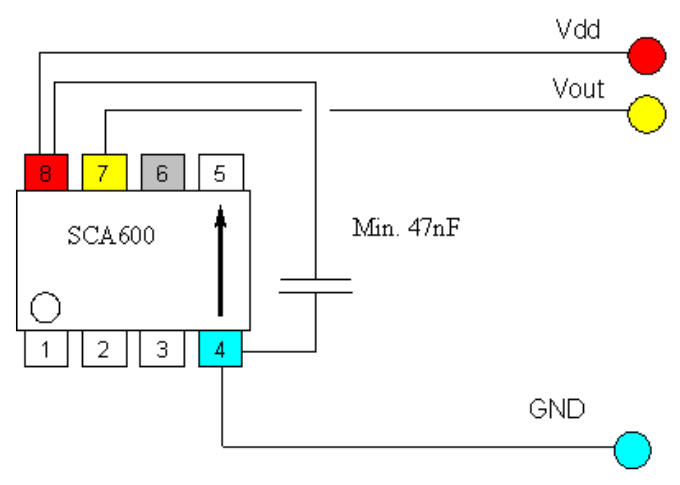
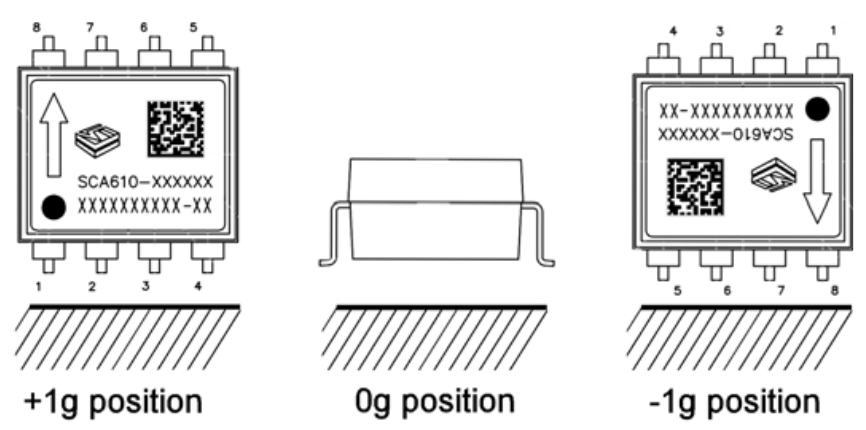

# 1-Axis Analog Accelerometer

## Introduction

Here we gonna use `SCA610-C28H1A`.

It got pin-map like this:



It will act like this:



* When you put the chip flat, you'll get 2.5V
* When the chip arrow point to the sky, you'll get 4.5V
* When the chip arrow point to the ground, you'll get 0.5V

## Code

```c
#include <msp430.h>
#include <stdio.h>
#include <stdlib.h>
#include <string.h>

// ***************
// ****************
// SET LCD!!!!!!!!!!!!!!!!!!!!!!!!!!!!!!!!!!!!!!!
// RS: P1.0
// R/W: P1.1
// E: P1.2
// ***************
// ****************
#define CS1 P1OUT |= BIT0 // RS
#define CS0 P1OUT &= BIT0
#define SID1 P1OUT |= BIT1 // R/W
#define SID0 P1OUT &= ~BIT1
#define SCLK1 P1OUT |= BIT2 // E
#define SCLK0 P1OUT &= ~BIT2
// PSB connect to ground since we only use serial transition mode

// data=00001100, always remember it's "d7 d6 d5 d4 d3 d2 d1 d0"
// if you need to know how to set d7-d0, just check ST7920V30_eng.pdf

#define chip_select_1 CS1 // RS
#define chip_select_0 CS0
#define serial_data_input_1 SID1 // R/W
#define serial_data_input_0 SID0
#define serial_clock_1 SCLK1 // E
#define serial_clock_0 SCLK0

void millisecond_of_delay(unsigned int t) {
    while (t--) {
        // delay for 1ms
        __delay_cycles(1000);
    }
}

void send_byte(unsigned char eight_bits) {
    unsigned int i;

    for (i = 0; i < 8; i++) {
        // 1111 1000 & 1000 0000 = 1000 0000 = True
        // 1111 0000 & 1000 0000 = 1000 0000 = True
        // 1110 0000 & 1000 0000 = 1000 0000 = True
        //...
        // 0000 0000 & 1000 0000 = 0000 0000 = False
        // The main purpose for this is to send a series of binary number from
        // left to right
        if ((eight_bits << i) & 0x80) {
            serial_data_input_1;
        } else {
            serial_data_input_0;
        }
        // We use this to simulate clock:
        serial_clock_0;
        serial_clock_1;
    }
}

void write_command(unsigned char command) {
    chip_select_1;

    send_byte(0xf8);
    /*
    f8=1111 1000;
    send five 1 first, so LCD will papare for receiving data;
    then R/W = 0, RS = 0;
    when RS = 0, won't write d7-d0 to RAM
    */
    send_byte(command & 0xf0);        // send d7-d4
    send_byte((command << 4) & 0xf0); // send d3-d0
    /*
    f0 = 1111 0000

    if character = 1100 0011
    first send 1100 0000 (d7-d4 0000)
    then send 0011 0000 (d3-d0 0000)
    */

    millisecond_of_delay(1);
    chip_select_0; // when chip_select from 1 to 0, serial counter and data will
                   // be reset
}

void write_data(unsigned char character) {
    chip_select_1;

    send_byte(0xfa);
    /*
    fa=1111 1010;

    send five 1 first, so LCD will papare for receiving data;
    then R/W = 0, RS = 1;
    when RS = 1, write d7-d0 to RAM
    */
    send_byte(character & 0xf0);        // send d7-d4
    send_byte((character << 4) & 0xf0); // send d3-d0
    /*
    f0 = 1111 0000

    if character = 1100 0011
    first send 1100 0000 (d7-d4 0000)
    then send 0011 0000 (d3-d0 0000)
    */

    millisecond_of_delay(1);
    chip_select_0;
}

void print_string(unsigned int x, unsigned int y, unsigned char *string) {
    switch (y) {
    case 1:
        write_command(0x80 + x);
        break;
    case 2:
        write_command(0x90 + x);
        break;
    case 3:
        write_command(0x88 + x);
        break;
    case 4:
        write_command(0x98 + x);
        break;
    default:
        break;
    }

    while (*string > 0) {
        write_data(*string);
        string++;
        millisecond_of_delay(1);
    }
}

void print_number(int x, int y, long int number) {
    char text[20];
    sprintf(text, "%d", number);
    print_string(x, y, text);
}

void reverse_a_string_with_certain_length(char *str, int len) {
    int i = 0, j = len - 1, temp;
    while (i < j) {
        temp = str[i];
        str[i] = str[j];
        str[j] = temp;
        i++;
        j--;
    }
}

int int_to_string(int x, char str[], int d) {
    int i = 0;
    while (x) {
        str[i++] = (x % 10) + '0';
        x = x / 10;
    }

    // If number of digits required is more, then
    // add 0s at the beginning
    while (i < d)
        str[i++] = '0';

    reverse_a_string_with_certain_length(str, i);
    str[i] = '\0';
    return i;
}

void float_to_string(float n, char *res, int afterpoint) {
    // Extract integer part
    int ipart = (int)n;

    // Extract floating part
    float fpart = n - (float)ipart;

    // convert integer part to string
    int i = int_to_string(ipart, res, 0);

    // check for display option after point
    if (afterpoint != 0) {
        res[i] = '.'; // add dot

        // Get the value of fraction part upto given no.
        // of points after dot. The third parameter is needed
        // to handle cases like 233.007
        int power = 1;
        int count_num = 0;
        for (; count_num < afterpoint; count_num++) {
            power = power * 10;
        }
        fpart = fpart * power;

        int_to_string((int)fpart, res + i + 1, afterpoint);
    }
}

void print_float(int x, int y, float number) {
    char text[20];
    if (number < 0){
        number = abs(number);
        char text2[20];
        strcpy(text, "-");
        float_to_string(number, text2, 4);
        strcat(text, text2);
    } else {
        float_to_string(number, text, 4);
    }
    print_string(x, y, text);
}

void screen_clean() {
    write_command(0x01);
}

void initialize_LCD() {
    P1DIR = 0xFF;
    P1OUT = 0x00;

    millisecond_of_delay(1000); // delay for LCD to wake up

    write_command(0x30); // 30=0011 0000; use `basic instruction mode`, use
                         // `8-BIT interface`
    millisecond_of_delay(20);
    write_command(0x0c); // 0c=0000 1100; DISPLAY ON, cursor OFF, blink OFF
    millisecond_of_delay(20);
    write_command(0x01); // 0c=0000 0001; CLEAR

    millisecond_of_delay(200);
}

// ***************
// ****************
// SET Voltage Sensor!!!!!!!!!!!!!!!!!!!!!!!!!!!!!!!!!!!!!!!
// ***************
// ****************

void initialize_voltage_sensor() {
    ADC12CTL0 = SHT0_2 + ADC12ON; // Set Sample/Hold time ;  Turn On ADC12
    ADC12CTL1 = SHP;              // Use sampling timer | ADC12 Sample/Hold Pulse Mode
    //ADC12IE = BIT0;               // Enable interrupt | ADC12 Interrupt Enable
    ADC12CTL0 |= ENC; // Conversion enabled | ADC12 Enable Conversion

    __delay_cycles(1000); // Wait for ADC Ref to settle
    P6SEL |= BIT0;        // P6.0 ADC option select | Port 6 Selection; set this pin as a Peripheral-pin, not just use a simple I/O Function anymore
}

float get_value_from_voltage_sensor() {
    ADC12CTL0 |= ADC12SC; // Sampling open | ADC12 Start Conversion

    while ((ADC12IFG & BIT0) == 0) {
        // If no new value was sent to ADC12MEM0, we wait here.
    }

    ADC12IFG &= ~BIT0; // set ADC interrupt flag to 0. After a new analog value has been giving to ADC12MEM0, ADC12IFG will be set to 1 automatically.

    return ADC12MEM0;
}

float map_range(float value, float fromLow, float fromHigh, float toLow, float toHigh) {
    // A function just like map() in arduino
    if (value < fromLow) {
        value = fromLow;
    } else if (value > fromHigh) {
        value = fromHigh;
    }

    float target_value = ((toHigh - toLow) / (fromHigh - fromLow)) * (value - fromLow) + toLow;

    return target_value;
}

int main(void) {
    WDTCTL = WDTPW + WDTHOLD; // Stop WDT

    initialize_LCD();
    initialize_voltage_sensor();

    while (1) {
        float value = get_value_from_voltage_sensor();
        print_float(0, 1, value);

        float angle = map_range(value, 395, 3536, -90, 90);
        print_float(0, 2, angle);
    }
}
```

## Combine it with a motor

```c
#include <msp430.h>
#include <stdio.h>
#include <stdlib.h>
#include <string.h>

// ***************
// ****************
// SET LCD!!!!!!!!!!!!!!!!!!!!!!!!!!!!!!!!!!!!!!!
// RS: P1.0
// R/W: P1.1
// E: P1.2
// ***************
// ****************
#define CS1 P1OUT |= BIT0 // RS
#define CS0 P1OUT &= BIT0
#define SID1 P1OUT |= BIT1 // R/W
#define SID0 P1OUT &= ~BIT1
#define SCLK1 P1OUT |= BIT2 // E
#define SCLK0 P1OUT &= ~BIT2
// PSB connect to ground since we only use serial transition mode

// data=00001100, always remember it's "d7 d6 d5 d4 d3 d2 d1 d0"
// if you need to know how to set d7-d0, just check ST7920V30_eng.pdf

#define chip_select_1 CS1 // RS
#define chip_select_0 CS0
#define serial_data_input_1 SID1 // R/W
#define serial_data_input_0 SID0
#define serial_clock_1 SCLK1 // E
#define serial_clock_0 SCLK0

void millisecond_of_delay(unsigned int t) {
    while (t--) {
        // delay for 1ms
        __delay_cycles(1000);
    }
}

void send_byte(unsigned char eight_bits) {
    unsigned int i;

    for (i = 0; i < 8; i++) {
        // 1111 1000 & 1000 0000 = 1000 0000 = True
        // 1111 0000 & 1000 0000 = 1000 0000 = True
        // 1110 0000 & 1000 0000 = 1000 0000 = True
        //...
        // 0000 0000 & 1000 0000 = 0000 0000 = False
        // The main purpose for this is to send a series of binary number from
        // left to right
        if ((eight_bits << i) & 0x80) {
            serial_data_input_1;
        } else {
            serial_data_input_0;
        }
        // We use this to simulate clock:
        serial_clock_0;
        serial_clock_1;
    }
}

void write_command(unsigned char command) {
    chip_select_1;

    send_byte(0xf8);
    /*
    f8=1111 1000;
    send five 1 first, so LCD will papare for receiving data;
    then R/W = 0, RS = 0;
    when RS = 0, won't write d7-d0 to RAM
    */
    send_byte(command & 0xf0);        // send d7-d4
    send_byte((command << 4) & 0xf0); // send d3-d0
    /*
    f0 = 1111 0000

    if character = 1100 0011
    first send 1100 0000 (d7-d4 0000)
    then send 0011 0000 (d3-d0 0000)
    */

    millisecond_of_delay(1);
    chip_select_0; // when chip_select from 1 to 0, serial counter and data will
                   // be reset
}

void write_data(unsigned char character) {
    chip_select_1;

    send_byte(0xfa);
    /*
    fa=1111 1010;

    send five 1 first, so LCD will papare for receiving data;
    then R/W = 0, RS = 1;
    when RS = 1, write d7-d0 to RAM
    */
    send_byte(character & 0xf0);        // send d7-d4
    send_byte((character << 4) & 0xf0); // send d3-d0
    /*
    f0 = 1111 0000

    if character = 1100 0011
    first send 1100 0000 (d7-d4 0000)
    then send 0011 0000 (d3-d0 0000)
    */

    millisecond_of_delay(1);
    chip_select_0;
}

void print_string(unsigned int x, unsigned int y, unsigned char *string) {
    switch (y) {
    case 1:
        write_command(0x80 + x);
        break;
    case 2:
        write_command(0x90 + x);
        break;
    case 3:
        write_command(0x88 + x);
        break;
    case 4:
        write_command(0x98 + x);
        break;
    default:
        break;
    }

    while (*string > 0) {
        write_data(*string);
        string++;
        millisecond_of_delay(1);
    }
}

void print_number(int x, int y, long int number) {
    char text[20];
    sprintf(text, "%d", number);
    print_string(x, y, text);
}

void reverse_a_string_with_certain_length(char *str, int len) {
    int i = 0, j = len - 1, temp;
    while (i < j) {
        temp = str[i];
        str[i] = str[j];
        str[j] = temp;
        i++;
        j--;
    }
}

int int_to_string(int x, char str[], int d) {
    int i = 0;
    while (x) {
        str[i++] = (x % 10) + '0';
        x = x / 10;
    }

    // If number of digits required is more, then
    // add 0s at the beginning
    while (i < d)
        str[i++] = '0';

    reverse_a_string_with_certain_length(str, i);
    str[i] = '\0';
    return i;
}

void float_to_string(float n, char *res, int afterpoint) {
    // Extract integer part
    int ipart = (int)n;

    // Extract floating part
    float fpart = n - (float)ipart;

    // convert integer part to string
    int i = int_to_string(ipart, res, 0);

    // check for display option after point
    if (afterpoint != 0) {
        res[i] = '.'; // add dot

        // Get the value of fraction part upto given no.
        // of points after dot. The third parameter is needed
        // to handle cases like 233.007
        int power = 1;
        int count_num = 0;
        for (; count_num < afterpoint; count_num++) {
            power = power * 10;
        }
        fpart = fpart * power;

        int_to_string((int)fpart, res + i + 1, afterpoint);
    }
}

void print_float(int x, int y, float number) {
    char text[20];
    if (number < 0) {
        number = abs(number);
        char text2[20];
        strcpy(text, "-");
        float_to_string(number, text2, 4);
        strcat(text, text2);
    } else {
        float_to_string(number, text, 4);
    }
    print_string(x, y, text);
}

void screen_clean() {
    write_command(0x01);
}

void initialize_LCD() {
    P1DIR = 0xFF;
    P1OUT = 0x00;

    millisecond_of_delay(1000); // delay for LCD to wake up

    write_command(0x30); // 30=0011 0000; use `basic instruction mode`, use
                         // `8-BIT interface`
    millisecond_of_delay(20);
    write_command(0x0c); // 0c=0000 1100; DISPLAY ON, cursor OFF, blink OFF
    millisecond_of_delay(20);
    write_command(0x01); // 0c=0000 0001; CLEAR

    millisecond_of_delay(200);
}

// ***************
// ****************
// SET Motor Driver!!!!!!!!!!!!!!!!!!!!!!!!!!!!!!!!!!!!!!!
//
// Input 1: P3.1
// Input 2: P3.2
// Input 3: P3.3
// Input 4: P3.4
//
// Enable 1: P1.6
// Enable 2: P1.7
// ***************
// ****************

#define pin_of_motor1_driver_input1 BIT1
#define pin_of_motor1_driver_input2 BIT2

#define pin_of_motor2_driver_input1 BIT3
#define pin_of_motor2_driver_input2 BIT4

#define pin_of_motor1_driver_enable BIT6 // to give the power to the circuit
#define pin_of_motor2_driver_enable BIT7 // to give the power to the circuit

#define set_motor_control_pin_as_output P3DIR |= (pin_of_motor1_driver_input1 | pin_of_motor1_driver_input2 | pin_of_motor2_driver_input1 | pin_of_motor2_driver_input2)
#define set_motor_enable_pin_as_output P1DIR |= (pin_of_motor1_driver_enable | pin_of_motor2_driver_enable)

#define set_pin_of_motor1_driver_input1_to_0 \
    P3OUT &= ~pin_of_motor1_driver_input1 // P3 means Port3, and Port3 has 8 \
                                          // pins from P3.0 to P3.7
#define set_pin_of_motor1_driver_input1_to_1 \
    P3OUT |= pin_of_motor1_driver_input1 // P3 means Port3, and Port3 has 8 pins \
                                         // from P3.0 to P3.7
#define set_pin_of_motor1_driver_input2_to_0 \
    P3OUT &= ~pin_of_motor1_driver_input2 // P3 means Port3, and Port3 has 8 \
                                          // pins from P3.0 to P3.7
#define set_pin_of_motor1_driver_input2_to_1 \
    P3OUT |= pin_of_motor1_driver_input2 // P3 means Port3, and Port3 has 8 pins \
                                         // from P3.0 to P3.7

#define set_pin_of_motor2_driver_input1_to_0 \
    P3OUT &= ~pin_of_motor2_driver_input1 // P3 means Port3, and Port3 has 8 \
                                          // pins from P3.0 to P3.7
#define set_pin_of_motor2_driver_input1_to_1 \
    P3OUT |= pin_of_motor2_driver_input1 // P3 means Port3, and Port3 has 8 pins \
                                         // from P3.0 to P3.7
#define set_pin_of_motor2_driver_input2_to_0 \
    P3OUT &= ~pin_of_motor2_driver_input2 // P3 means Port3, and Port3 has 8 \
                                          // pins from P3.0 to P3.7
#define set_pin_of_motor2_driver_input2_to_1 \
    P3OUT |= pin_of_motor2_driver_input2 // P3 means Port3, and Port3 has 8 pins \
                                         // from P3.0 to P3.7

unsigned int a_period_of_time = 1000 - 1;

void update_motor_speed(int which_motor, float speed) {
    if (which_motor == 1) {
        TACCR1 = (int)(a_period_of_time * speed);
    } else if (which_motor == 2) {
        TACCR2 = (int)(a_period_of_time * speed);
    }
}

void initialize_motor_driver() {
    set_motor_control_pin_as_output;
    set_motor_enable_pin_as_output;

    P1SEL |= (pin_of_motor1_driver_enable | pin_of_motor2_driver_enable); // Peripheral module function is selected for the pin 1.6 and pin 1.7

    TACCR0 = a_period_of_time;

    TACCTL1 = OUTMOD_7; //Timer A Capture/Compare Control 1; PWM output mode: 7 - PWM reset/set
    update_motor_speed(1, 0);

    TACCTL2 = OUTMOD_7; //Timer A Capture/Compare Control 2; PWM output mode: 7 - PWM reset/set
    update_motor_speed(2, 0);

    TACTL = TASSEL_2 + MC_1; // Timer A Control (control all); SMCLK Clock = 1MHz; Up mode, count from 0 to TACCR1
}

void stop_motor(int which_motor) {
    if (which_motor == 1) {
        set_pin_of_motor1_driver_input1_to_0;
        set_pin_of_motor1_driver_input2_to_0;
    } else if (which_motor == 2) {
        set_pin_of_motor2_driver_input1_to_0;
        set_pin_of_motor2_driver_input2_to_0;
    }

    update_motor_speed(1, 0);
    update_motor_speed(2, 0);
}

void make_the_motor_still(int which_motor) {
    if (which_motor == 1) {
        set_pin_of_motor1_driver_input1_to_1;
        set_pin_of_motor1_driver_input2_to_1;
    } else if (which_motor == 2) {
        set_pin_of_motor2_driver_input1_to_1;
        set_pin_of_motor2_driver_input2_to_1;
    }
}

void motor_forward(int which_motor, float speed) {
    if (which_motor == 1) {
        set_pin_of_motor1_driver_input1_to_1;
        set_pin_of_motor1_driver_input2_to_0;
    } else if (which_motor == 2) {
        set_pin_of_motor2_driver_input1_to_1;
        set_pin_of_motor2_driver_input2_to_0;
    }

    update_motor_speed(which_motor, speed);
}

void motor_backward(int which_motor, float speed) {
    if (which_motor == 1) {
        set_pin_of_motor1_driver_input1_to_0;
        set_pin_of_motor1_driver_input2_to_1;
    } else if (which_motor == 2) {
        set_pin_of_motor2_driver_input1_to_0;
        set_pin_of_motor2_driver_input2_to_1;
    }

    update_motor_speed(which_motor, speed);
}

// ***************
// ****************
// SET Voltage Sensor!!!!!!!!!!!!!!!!!!!!!!!!!!!!!!!!!!!!!!!
// Receiving analog value from P6.0
// ***************
// ****************

void initialize_voltage_sensor() {
    ADC12CTL0 = SHT0_2 + ADC12ON; // Set Sample/Hold time ;  Turn On ADC12
    ADC12CTL1 = SHP;              // Use sampling timer | ADC12 Sample/Hold Pulse Mode
    //ADC12IE = BIT0;               // Enable interrupt | ADC12 Interrupt Enable
    ADC12CTL0 |= ENC; // Conversion enabled | ADC12 Enable Conversion

    __delay_cycles(1000); // Wait for ADC Ref to settle
    P6SEL |= BIT0;        // P6.0 ADC option select | Port 6 Selection; set this pin as a Peripheral-pin, not just use a simple I/O Function anymore
}

float get_value_from_voltage_sensor() {
    ADC12CTL0 |= ADC12SC; // Sampling open | ADC12 Start Conversion

    while ((ADC12IFG & BIT0) == 0) {
        // If no new value was sent to ADC12MEM0, we wait here.
    }

    ADC12IFG &= ~BIT0; // set ADC interrupt flag to 0. After a new analog value has been giving to ADC12MEM0, ADC12IFG will be set to 1 automatically.

    return ADC12MEM0;
}

float map_range(float value, float fromLow, float fromHigh, float toLow, float toHigh) {
    // A function just like map() in arduino
    if (value < fromLow) {
        value = fromLow;
    } else if (value > fromHigh) {
        value = fromHigh;
    }

    float target_value = ((toHigh - toLow) / (fromHigh - fromLow)) * (value - fromLow) + toLow;

    return target_value;
}

float get_dynamic_approaching_speed(int target_distance, int real_distance, int approaching_length, float max_speed, float min_speed) {
    // loss: distance between target value and real value
    // approaching_length: when real value approaching this area, the speed need to get change to adapt the new situation
    int loss = abs(target_distance - real_distance);
    //print_float(0, 3, loss);
    float speed = loss / (approaching_length / max_speed);

    if (speed < min_speed) {
        speed = min_speed;
    }

    print_float(0, 4, speed);
    return speed;
}

void dynamiclly_control_motor(int which_motor, int target_value, int real_value) {
    float speed = get_dynamic_approaching_speed(target_value, real_value, 45, 0.2, 0.1);
    //print_float(0, 3, speed);

    if (target_value > real_value) {
        motor_forward(which_motor, speed);
    } else if (target_value < real_value) {
        motor_backward(which_motor, speed);
    } else if (target_value == real_value) {
        make_the_motor_still(which_motor);
    }

    millisecond_of_delay(100);
    stop_motor(1);
    screen_clean();
}

int main(void) {
    WDTCTL = WDTPW + WDTHOLD; // Stop WDT

    initialize_LCD();
    initialize_motor_driver();
    initialize_voltage_sensor();

    while (1) {
        float value = get_value_from_voltage_sensor();
        print_float(0, 1, value);

        int angle = map_range(value, 395, 3526, -90, 90);
        print_number(0, 2, angle);

        dynamiclly_control_motor(1, 0, angle);
        //millisecond_of_delay(500);
        //screen_clean();
    }
}
```

