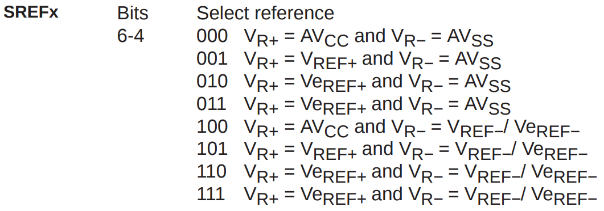
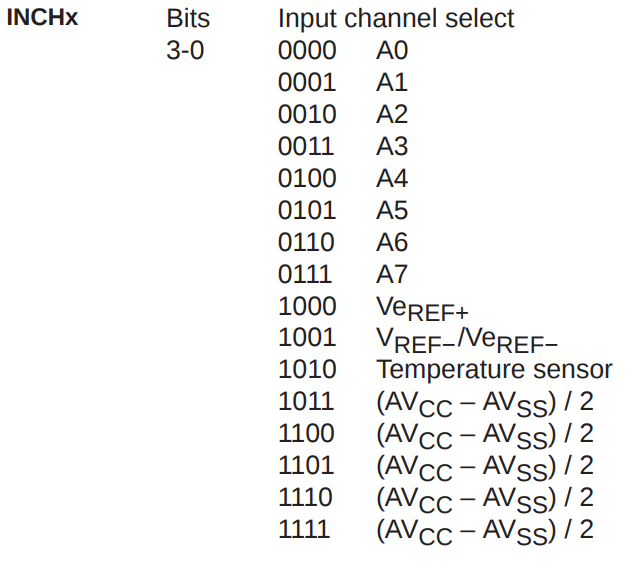

# Analog to Digital Converter

## A simple example

```c
//  Description: A single sample is made on P6.0/A0 with reference to AVcc.
//  Software sets ADC10SC to start sample and conversion - ADC12SC
//  automatically cleared at EOC. ADC12 internal oscillator times sample (16x)
//  and conversion. In Mainloop MSP430 waits in LPM0 to save power until ADC12
//  conversion complete, ADC12_ISR will force exit from LPM0 in Mainloop on
//  reti. If A0 > 0.5*AVcc, P1.0 set, else reset.
//
//                MSP430F149
//             -----------------
//         /|\|              XIN|-
//          | |                 |
//          --|RST          XOUT|-
//            |                 |
//      Vin-->|P6.0/A0      P1.0|--> LED

//******************************************************************************

#include <msp430.h>

int main(void)
{
    WDTCTL = WDTPW + WDTHOLD;                 // Stop WDT

    ADC12CTL0 = SHT0_2 + ADC12ON;             // Set Sample/Hold time ;  Turn On ADC12
    ADC12CTL1 = SHP;                          // Use sampling timer | ADC12 Sample/Hold Pulse Mode
    ADC12IE = BIT0;                           // Enable interrupt | ADC12 Interrupt Enable
    ADC12CTL0 |= ENC;                         // Conversion enabled | ADC12 Enable Conversion
    P6SEL |= BIT0;                            // P6.0 ADC option select | Port 6 Selection; set this pin as a Peripheral-pin, not just use a simple I/O Function anymore
    P1DIR |= BIT0;                            // P1.0 output

    for (;;)
    {
        // This should actually happen in a timer interrupt where
        // we may like to sample only once in, say 1 second

        __delay_cycles(1000);               // Wait for ADC Ref to settle
        ADC12CTL0 |= ADC12SC;                   // Sampling open | ADC12 Start Conversion
        __bis_SR_register(CPUOFF + GIE);      // LPM0, ADC12_ISR will force exit
    }
}

// ADC12 interrupt service routine
#pragma vector=ADC12_VECTOR
__interrupt void ADC12_ISR(void)
{
    // We assume that ADC12MEM0 is in a range of (0, 4095)
    // 0x7FF = 2047
    if (ADC12MEM0 < 0x7FF) {
        P1OUT &= ~BIT0;                       // Clear P1.0 LED off
    }
    else {
        P1OUT |= BIT0;                        // Set P1.0 LED on
    }
    __bic_SR_register_on_exit(CPUOFF);      // Clear CPUOFF bit from 0(SR)
}
```

### About ADC12

ADC12 = \(12-bit sample-and-hold\) **Analog-to-Digital Converter**

> An ADC's job is to perform a conversion by sampling `an analog voltage` into `a digital value`.

ADC12CTL0 = ADC12 Control Register 0

> The ADC12 conversion core is configured using `ADC12CTL0` and `ADC12CTL1`.
>
> A `Control Register` is nothing but a variable where stores `controlling information`.

SHT0\_2 = Sample Hold 0, Select Bit: 2

ADC12MCTL0 = ADC12 Memory Control 0

SREF\_0 = Select Reference 0

ADC12MEM0 = ADC12 Conversion Memory 0

> Digital result will be saving to `ADC12MEM(ADC12 Conversion Memory)`

### About PxSEL

P6SEL = Port 6 Select Register

> Each PxSEL bit is used to select the pin function − `I/O port` or `peripheral module` function.

* P6SEL = 0:  `I/O Function` is selected for the pin
* P6SEL = 1:  `Peripheral module function` is selected for the pin

### SR\_register

`__bis_SR_register(LPM0_bits)` : Enter Low Power Mode 0

`__bic_SR_register_on_exit(LPM0_bits)` : Exit Low Power Mode 0

## A example without Interruption

```c
/*
If you give P6.0 5V, P6.1 will go high.
If you give P6.0 0V, P6.1 will go low.
*/
#include <msp430.h>

int main(void) {
    WDTCTL = WDTPW + WDTHOLD; // Stop WDT

    ADC12CTL0 = SHT0_2 + ADC12ON; // Set Sample/Hold time ;  Turn On ADC12
    ADC12CTL1 = SHP;              // Use sampling timer | ADC12 Sample/Hold Pulse Mode
    //ADC12IE = BIT0;               // Enable interrupt | ADC12 Interrupt Enable
    ADC12CTL0 |= ENC;             // Conversion enabled | ADC12 Enable Conversion

    __delay_cycles(1000); // Wait for ADC Ref to settle
    P6SEL |= BIT0;        // P6.0 ADC option select | Port 6 Selection; set this pin as a Peripheral-pin, not just use a simple I/O Function anymore
    P6DIR |= BIT1;        // Set P6.1 as output

    for (;;) {
        ADC12CTL0 |= ADC12SC; // Sampling open | ADC12 Start Conversion

        while ((ADC12IFG & BIT0) == 0) {
            // If no new value was sent to ADC12MEM0, we wait here.
        }

        if (ADC12MEM0 < 0x7FF) {
            P6OUT &= ~BIT1; // Clear P1.0 LED off
        } else {
            P6OUT |= BIT1; // Set P1.0 LED on
        }

        ADC12IFG &= ~BIT0; // set ADC interrupt flag to 0. After a new analog value has been giving to ADC12MEM0, ADC12IFG will be set to 1 automatically.
    }
}
```

## Make a Voltage-Meter with ADC and LCD

```c
#include "msp430.h"
#include <stdio.h>

// ***************
// ****************
// SET LCD!!!!!!!!!!!!!!!!!!!!!!!!!!!!!!!!!!!!!!!
// ***************
// ****************
#define CS1 P1OUT |= BIT0 //RS
#define CS0 P1OUT &= BIT0
#define SID1 P1OUT |= BIT1 //R/W
#define SID0 P1OUT &= ~BIT1
#define SCLK1 P1OUT |= BIT2 //E
#define SCLK0 P1OUT &= ~BIT2
// PSB connect to ground since we only use serial transition mode

//data=00001100, always remember it's "d7 d6 d5 d4 d3 d2 d1 d0"
//if you need to know how to set d7-d0, just check ST7920V30_eng.pdf

#define chip_select_1 CS1 //RS
#define chip_select_0 CS0
#define serial_data_input_1 SID1 //R/W
#define serial_data_input_0 SID0
#define serial_clock_1 SCLK1 //E
#define serial_clock_0 SCLK0

void delay(unsigned int t)
{
    while (t--)
    {
        // delay for 1ms
        __delay_cycles(1000);
    }
}

void send_byte(unsigned char eight_bits)
{
    unsigned int i;

    for (i = 0; i < 8; i++)
    {
        //1111 1000 & 1000 0000 = 1000 0000 = True
        //1111 0000 & 1000 0000 = 1000 0000 = True
        //1110 0000 & 1000 0000 = 1000 0000 = True
        //...
        //0000 0000 & 1000 0000 = 0000 0000 = False
        //The main purpose for this is to send a series of binary number from left to right
        if ((eight_bits << i) & 0x80)
        {
            serial_data_input_1;
        }
        else
        {
            serial_data_input_0;
        }
        // We use this to simulate clock:
        serial_clock_0;
        serial_clock_1;
    }
}

void write_command(unsigned char command)
{
    chip_select_1;

    send_byte(0xf8);
    /*
    f8=1111 1000;
    send five 1 first, so LCD will papare for receiving data;
    then R/W = 0, RS = 0;
    when RS = 0, won't write d7-d0 to RAM
    */
    send_byte(command & 0xf0);        //send d7-d4
    send_byte((command << 4) & 0xf0); //send d3-d0
    /*
    f0 = 1111 0000

    if character = 1100 0011
    first send 1100 0000 (d7-d4 0000)
    then send 0011 0000 (d3-d0 0000)
    */

    delay(1);
    chip_select_0; // when chip_select from 1 to 0, serial counter and data will be reset
}

void write_data(unsigned char character)
{
    chip_select_1;

    send_byte(0xfa);
    /*
    fa=1111 1010;

    send five 1 first, so LCD will papare for receiving data;
    then R/W = 0, RS = 1;
    when RS = 1, write d7-d0 to RAM
    */
    send_byte(character & 0xf0);        //send d7-d4
    send_byte((character << 4) & 0xf0); //send d3-d0
    /*
    f0 = 1111 0000

    if character = 1100 0011
    first send 1100 0000 (d7-d4 0000)
    then send 0011 0000 (d3-d0 0000)
    */

    delay(1);
    chip_select_0;
}

void print_string(unsigned int x, unsigned int y, unsigned char *string)
{
    switch (y)
    {
    case 1:
        write_command(0x80 + x);
        break;
    case 2:
        write_command(0x90 + x);
        break;
    case 3:
        write_command(0x88 + x);
        break;
    case 4:
        write_command(0x98 + x);
        break;
    default:
        break;
    }

    while (*string > 0)
    {
        write_data(*string);
        string++;
        delay(1);
    }
}

void initialize_LCD()
{
    delay(1000); // delay for LCD to wake up

    write_command(0x30); // 30=0011 0000; use `basic instruction mode`, use `8-BIT interface`
    delay(20);
    write_command(0x0c); // 0c=0000 1100; DISPLAY ON, cursor OFF, blink OFF
    delay(20);
    write_command(0x01); // 0c=0000 0001; CLEAR

    delay(200);
}

void reverse_a_string_with_certain_length(char *str, int len)
{
    int i=0, j=len-1, temp;
    while (i<j)
    {
        temp = str[i];
        str[i] = str[j];
        str[j] = temp;
        i++; j--;
    }
}

int int_to_string(int x, char str[], int d)
{
    int i = 0;
    while (x)
    {
        str[i++] = (x%10) + '0';
        x = x/10;
    }

    // If number of digits required is more, then
    // add 0s at the beginning
    while (i < d)
        str[i++] = '0';

    reverse_a_string_with_certain_length(str, i);
    str[i] = '\0';
    return i;
}

void float_to_string(float n, char *res, int afterpoint)
{
    // Extract integer part
    int ipart = (int)n;

    // Extract floating part
    float fpart = n - (float)ipart;

    // convert integer part to string
    int i = int_to_string(ipart, res, 0);

    // check for display option after point
    if (afterpoint != 0)
    {
        res[i] = '.';  // add dot

        // Get the value of fraction part upto given no.
        // of points after dot. The third parameter is needed
        // to handle cases like 233.007
        int power = 1;
        int count_num = 0;
        for (; count_num < afterpoint; count_num ++) {
            power = power * 10;
        }
        fpart = fpart * power;

        int_to_string((int)fpart, res + i + 1, afterpoint);
    }
}

int main(void)
{
    WDTCTL = WDTPW + WDTHOLD;                 // Stop WDT

    P1DIR = 0xFF;
    P1OUT = 0x00;

    initialize_LCD();

    ADC12CTL0 = SHT0_3 + ADC12ON;     // Set Sample/Hold time ;  Turn On ADC12;  Reference ON
    ADC12CTL1 = SHP;                          // Use sampling timer | ADC12 Sample/Hold Pulse Mode
    ADC12MCTL0 = SREF_0 + INCH_0;                      // posivetive_voltage_reference = AVcc = 3.3V ;  Anolog(ADC) Input Channel = A0, which is P6.0
    // if you don't set any reference-voltage, the Voltage-max(Vcc) will be 3.3V, the Vss will be 0V
    ADC12IE = BIT0;                           // Enable interrupt | ADC12 Interrupt Enable
    ADC12CTL0 |= ENC;                         // Conversion enabled | ADC12 Enable Conversion
    P6SEL |= BIT0;                            // P6.0 ADC option select | Port 6 Selection; set this pin as a Peripheral-pin, not just use a simple I/O Function anymore

    for (;;)
    {
        // This should actually happen in a timer interrupt where
        // we may like to sample only once in, say 1 second

        __delay_cycles(1000);               // Wait for ADC Ref to settle
        ADC12CTL0 |= ADC12SC;                   // Sampling open | ADC12 Start Conversion
        __bis_SR_register(CPUOFF + GIE);      // LPM0, ADC12_ISR will force exit
    }
}

// ADC12 interrupt service routine
#pragma vector=ADC12_VECTOR
__interrupt void ADC12_ISR(void)
{
    // We assume that ADC12MEM0 is in a range of (0, 4095)
    delay(200);

    unsigned int raw_number = ADC12MEM0;
    char voltage_string[30];

    // Get average_value of ADC12MEM0
    int all = 0;
    int i;
    for (i=0; i<8; i++) {
        all += ADC12MEM0;
    }
    int average_value = all/8;
    
    float voltage = (float)average_value/(float)4095*(float)5;
    float_to_string(voltage, voltage_string, 4);

    char text[30];
    sprintf(text, "voltage = %s", voltage_string);
    print_string(0, 1, text);

    sprintf(text, "voltage = %d", ADC12MEM0);
    print_string(0, 2, text);

    __bic_SR_register_on_exit(CPUOFF);      // Clear CPUOFF bit from 0(SR)
}
```

1. We use `ADC12CTL0` and `ADC12CTL1` to configure `ADC`
2. `ADC12MCTL0` = `ADC12 Memory Control 0`. We use this to set `reference-voltage` or `analog input channel`. 
3. `INCH_0` = `Analog Input Channel 0`. Once you set `ADC12MCTL0 = INCH_0`, the variable `ADC12MEM0` will only change according to `A0(Analog Input Channel 0)`. In this type of micro-controller, `A0` = `Port 6 and Pin 0` = `P6.0`.

## Some tables you may need






* Normally, AVcc means 3.3V, AVss means 0V.
* If you want to detect a voltage that greater than 3.3V, you have to use voltage-divider in an external circuit to convert the large voltage into 0-3.3V.
* You can get different analog value from `ADC12MEM0` by setting `INCH_x(Input Channel)`. For example, by using `ADC12MCTL0 = INCH_10`, you'll get temperature value from `ADC12MEM0`.

## References:



{% embed url="https://www.egr.msu.edu/classes/ece480/capstone/spring13/group04/application/Application%20note-karl.pdf" %}










