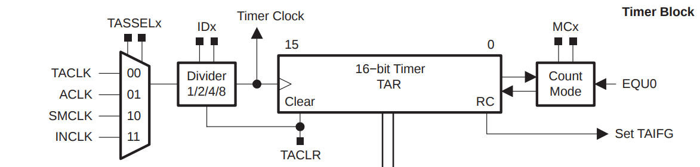
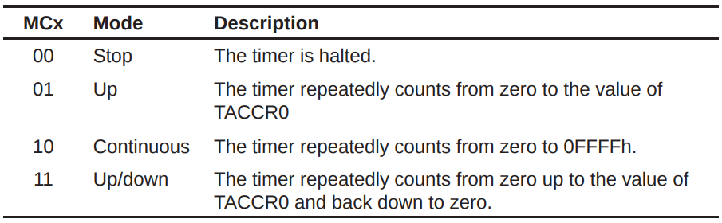

# Dive into Timer

## Codes

```c
#include <msp430.h>

unsigned int my_overflow_counting = 0;

void initTimer_B(void) {
    //Timer_B Configuration
    TBCCR0 = 0;                     // Timer B Capture/Compare Register 0; Stop Timer
    TBCCTL0 |= CCIE;                // Timer B Capture/Compare Control 0; Enable interrupt for CCR0.
    TBCTL = TBSSEL_2 + ID_0 + MC_1; // Timer B Control; TimerB Source-clock Select SMCLK, SMCLK divided by 1, UP Mode

    __enable_interrupt();
}

void delayMS(int milliseconds) {
    my_overflow_counting = 0; //Reset Over-Flow counter

    TBCCR0 = 1000 - 1; //Start Timer, Compare value for Up Mode to get 1ms delay per loop
    //Total count = TBCCR0 + 1. Hence we need to subtract 1.

    while (my_overflow_counting <= milliseconds) {
        ;
    }
}

//Timer ISR
#pragma vector = TIMER0_B0_VECTOR
__interrupt void Timer_B_CCR0_ISR(void) {
    my_overflow_counting++; //Increment Over-Flow Counter
}

int main(void) {
    WDTCTL = WDTPW + WDTHOLD; // Stop watchdog timer

    P6DIR |= BIT0;            // Configure P6.0 as Output
    P6OUT = 0x00;             // clear port 6

    // We assume SMCLK = 1MHz by default
    initTimer_B();

    while (1) {
        /*
        P6OUT ^= BIT0; //Drive P6.0 HIGH - LED1 ON
        delayMS(500); //Wait 0.5 Secs
        */

        P6OUT |= BIT0; //Drive P6.0 HIGH - LED1 ON
        delayMS(500);  //Wait 0.5 Secs

        P6OUT &= ~BIT0; //Drive P6.0 LOW - LED1 OFF
        delayMS(500);   //Wait 0.5 Secs
    }
}
```

```c
#include <msp430.h>

unsigned int custom_overflow_counting;

void initTimer_A(void)
{
    // Timer Configuration
    TACCR0 = 0;  // Initially, Stop the Timer
    TACCTL0 |= CCIE;  // Enable interrupt for CCR0.
    TACTL = TASSEL_2 + ID_0 + MC_1;  // Select SMCLK, SMCLK/1 , Up Mode
}

//Timer ISR
#pragma vector = TIMER0_A0_VECTOR
__interrupt void Timer_A_CCR0_ISR(void)
{
    custom_overflow_counting++;
    if (custom_overflow_counting >= 2000)  // 2000ms(millisecond)
    {
        P6OUT ^= BIT0;
        custom_overflow_counting = 0;
    }
}

int main(void)
{
    WDTCTL = WDTPW + WDTHOLD; // Stop watchdog timer
    P6DIR |= BIT0;  // Configure P6.0 as Output
    P6OUT = 0x00;  // Clear port 6

    // We assume SMCLK = 1MHz by default
    initTimer_A();
    __enable_interrupt();

    custom_overflow_counting = 0;
    TACCR0 = 1000 - 1; // Start Timer, Compare value for Up Mode to get 1ms delay per loop
    /*
     Total count = TACCR0 + 1. Hence we need to subtract 1.
     1000 ticks at 1MHz will yield a delay of 1ms.
     */

    while (1)
    {
        ; // yingshaoxo tip: this loop will block the main process. So the interrupt function could work better.
    }
}
```

### Use Timer to output Square Wave

```c
/*
P6.0 and P6,1 will output different squre wave
*/
#include <msp430.h>

void initTimer_B(void) {
    TBCCR0 = 0;      // Timer B Capture/Compare Register 0; Stop Timer
    TBCCTL0 |= CCIE; // Timer B Capture/Compare Control 0; Enable interrupt for CCR0.

    TBCTL = TBSSEL_2 + ID_0 + MC_1; // Timer B Control; TimerB Source-clock Select SMCLK, SMCLK = 1MHz, SMCLK divided by 1, up mode

    TBCCR0 = 1000 - 1; //Start Timer, Compare value for Up Mode to get 1ms delay per loop

    __enable_interrupt();
}

//Timer ISR
#pragma vector = TIMER0_B0_VECTOR
__interrupt void Timer_B_CCR0_ISR(void) {
}

int main(void) {
    WDTCTL = WDTPW + WDTHOLD; // Stop watchdog timer

    P6DIR |= (BIT0 | BIT1); // Configure P6.0-6.2 as Output
    P6OUT = 0x00;           // Clear port 6

    initTimer_B();

    while (1) {
        // TBR: Timer B Counter Register
        if (TBR < 0.2 * 999) {
            P6OUT |= BIT0;
        } else {
            P6OUT &= ~BIT0;
        }

        // TBR: Timer B Counter Register
        if (TBR < 0.5 * 999) {
            P6OUT |= BIT1;
        } else {
            P6OUT &= ~BIT1;
        }
    }
}
```

## Hardware



> TAR\(timerA register\) is a 16-bit counting register. This register is the thing that gets incremented \(or decremented\) as the timer counts up \(or down\). The “15” and “0” shows that the timer is 16-bits wide: it starts at bit 0 and goes up to bit 15; that’s 16 bits in total.
>
> The left part shows four signals: TACLK, ACLK, SMCLK, and INCLK. These are four different clock signals inside the MSP430. You select which of the four to use as the timer input clock using the _TASSEL_ bits inside the timer peripheral configuration registers. TASSEL stands for `Timer A Source-clock Select` .
>
> `IDx` can divide its input signal by 1, 2, 4, or 8. For example, if we set the ID divider to divide by 4 \(commonly written as “/4”\), it would take the input clock of 32768 Hz, divide it by 4, and the output would be 32768/4 = 8192 Hz. The divide by 1 \(or “/1”\) setting simply passes through the input signal unchanged.
>
> What’s the point of the divider?
>
> The micro-controller designer doesn’t know how fast \(or slow!\) you’ll want to run your timer, so they want to give you as much flexibility as possible.
>
> If they gave you no dividers at all, then you’d be stuck with whatever speed the four input clocks happened to be running at.
>
> Having a divider is better than no options.

`Timer A register` will count at 32768 Hz, meaning it will tick 32768 times per second.

## Timer Modes



It seems like you should chose `UP mode` if you want to control your timer by using `TACCR0`.

$$
0ffff \approx 32768 \times 2 = 65536
$$

## Interrupt

If you have set an Interrupt Service Routine, then that function will be called every time `timer register` overflows from `0xFFFF or TACCR0` back to `zero`.

## Time cost for each Timer Interrupt \(or TACCR0 Overflow\)

$$
\text{Timer Period in Seconds} = \frac{\text{Division} \times (TACCR0 + 1)}{\text{Input clock in Hz}}
$$

For example, if we use `a divider of 1`, `Input clock of 1MHz` and `TACCR0 = 1000-1 = 999`, we get:

$$
\text{Timer Period in Seconds} = \frac{\text{1} \times (999 + 1)}{1 \times 10^6} = 0.001\ Second = 1 \ ms = 1 \ millisecond
$$

That is to say, the interrupt function will be called per 1 millisecond.

## Delay

Use a Timer or Use a default function `__delay_cycles(x)`

> `__delay_cycles(x)` is stopping in the code and waiting for `x MCLK cycles`.
>
> For example, if you are working at `1 MHz` in your code,
>
> `__delay_cycles(1000)` will halt the code for `1000 * 1/1 MHz`.
>
> `__delay_cycles(1000*1000*1)` will halt `1000ms (1 second)`.
>
> It's OK for testing to use `__delay_cycles` but in a real program you shouldn't use it, since it really stops the whole program for that time.
>
> If you are relying on `Interrupts` and `some time-critical code`, `__delay_cycles` will probably mess your code up.

## What about the codes above?

For this section, the program does not important, the theory does.

## References:










