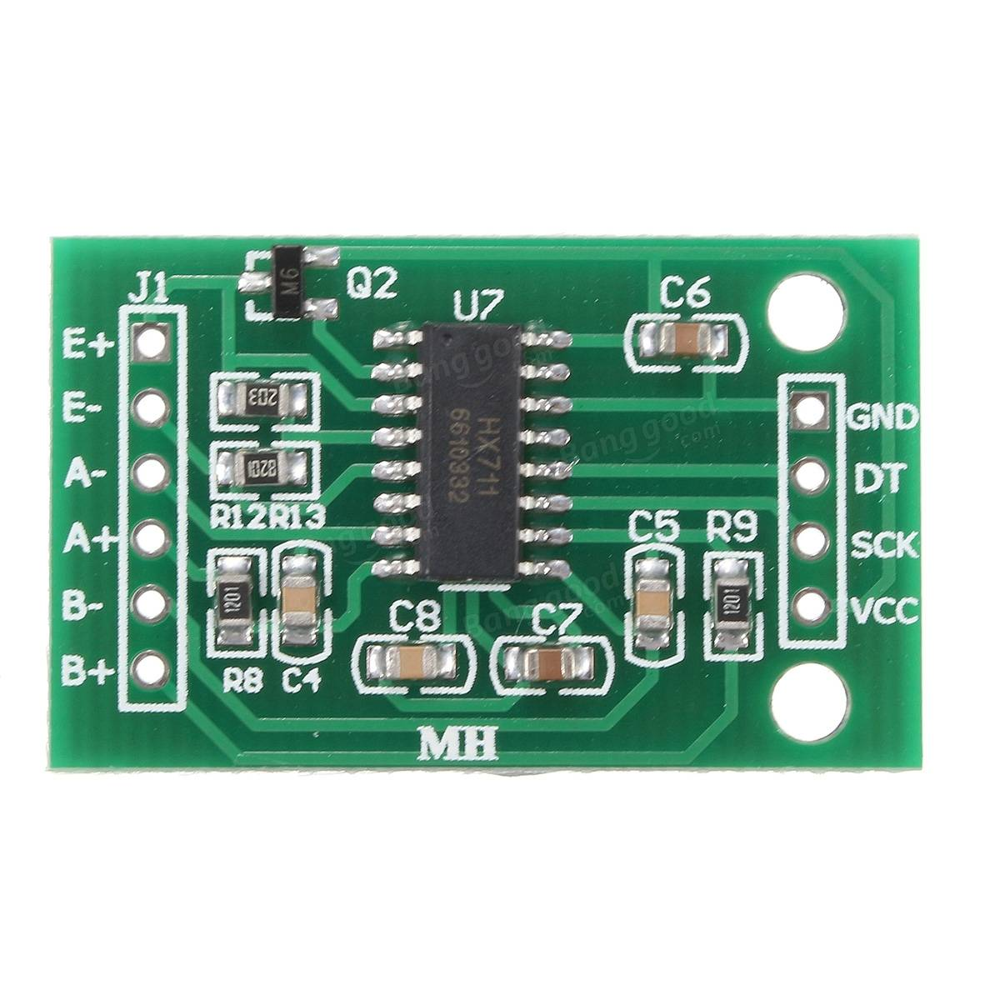

# HX711 Weight Sensor

## Introduction



* DT: Data \(line\)
* SCK: Source Clock \(line\)

## Core Code

```c
unsigned long read_weight(void) {
    unsigned long Count;
    unsigned int i;

    SCK = 0;
    Count = 0;

    while (DT) {
        ; // Wait until chip was ready
    }

    for (i = 0; i < 24; i++) {
        SCK = 1;
        Count = Count << 1;
        SCK = 0;

        if (DT) {
            Count++;
        }
    }

    SCK = 1;
    Count = Count ^ 0x800000; // Data conversion
    SCK = 0;

    return(Count);
}
```

## Work with MSPF169

```c
#include <msp430.h>
#include <stdio.h>
#include <stdlib.h>
#include <string.h>

// ***************
// ****************
// SET LCD!!!!!!!!!!!!!!!!!!!!!!!!!!!!!!!!!!!!!!!
// RS: P1.0
// R/W: P1.1
// E: P1.2
// ***************
// ****************
#define CS1 P1OUT |= BIT0 // RS
#define CS0 P1OUT &= BIT0
#define SID1 P1OUT |= BIT1 // R/W
#define SID0 P1OUT &= ~BIT1
#define SCLK1 P1OUT |= BIT2 // E
#define SCLK0 P1OUT &= ~BIT2
// PSB connect to ground since we only use serial transition mode

// data=00001100, always remember it's "d7 d6 d5 d4 d3 d2 d1 d0"
// if you need to know how to set d7-d0, just check ST7920V30_eng.pdf

#define chip_select_1 CS1 // RS
#define chip_select_0 CS0
#define serial_data_input_1 SID1 // R/W
#define serial_data_input_0 SID0
#define serial_clock_1 SCLK1 // E
#define serial_clock_0 SCLK0

void millisecond_of_delay(unsigned int t) {
    while (t--) {
        // delay for 1ms
        __delay_cycles(1000);
    }
}

void send_byte(unsigned char eight_bits) {
    unsigned int i;

    for (i = 0; i < 8; i++) {
        // 1111 1000 & 1000 0000 = 1000 0000 = True
        // 1111 0000 & 1000 0000 = 1000 0000 = True
        // 1110 0000 & 1000 0000 = 1000 0000 = True
        //...
        // 0000 0000 & 1000 0000 = 0000 0000 = False
        // The main purpose for this is to send a series of binary number from
        // left to right
        if ((eight_bits << i) & 0x80) {
            serial_data_input_1;
        } else {
            serial_data_input_0;
        }
        // We use this to simulate clock:
        serial_clock_0;
        serial_clock_1;
    }
}

void write_command(unsigned char command) {
    chip_select_1;

    send_byte(0xf8);
    /*
    f8=1111 1000;
    send five 1 first, so LCD will papare for receiving data;
    then R/W = 0, RS = 0;
    when RS = 0, won't write d7-d0 to RAM
    */
    send_byte(command & 0xf0);        // send d7-d4
    send_byte((command << 4) & 0xf0); // send d3-d0
    /*
    f0 = 1111 0000

    if character = 1100 0011
    first send 1100 0000 (d7-d4 0000)
    then send 0011 0000 (d3-d0 0000)
    */

    millisecond_of_delay(1);
    chip_select_0; // when chip_select from 1 to 0, serial counter and data will
                   // be reset
}

void write_data(unsigned char character) {
    chip_select_1;

    send_byte(0xfa);
    /*
    fa=1111 1010;

    send five 1 first, so LCD will papare for receiving data;
    then R/W = 0, RS = 1;
    when RS = 1, write d7-d0 to RAM
    */
    send_byte(character & 0xf0);        // send d7-d4
    send_byte((character << 4) & 0xf0); // send d3-d0
    /*
    f0 = 1111 0000

    if character = 1100 0011
    first send 1100 0000 (d7-d4 0000)
    then send 0011 0000 (d3-d0 0000)
    */

    millisecond_of_delay(1);
    chip_select_0;
}

void print_string(unsigned int x, unsigned int y, unsigned char *string) {
    switch (y) {
    case 1:
        write_command(0x80 + x);
        break;
    case 2:
        write_command(0x90 + x);
        break;
    case 3:
        write_command(0x88 + x);
        break;
    case 4:
        write_command(0x98 + x);
        break;
    default:
        break;
    }

    while (*string > 0) {
        write_data(*string);
        string++;
        millisecond_of_delay(1);
    }
}

void print_number(int x, int y, long int number) {
    char text[20];
    sprintf(text, "%d", number);
    print_string(x, y, text);
}

void reverse_a_string_with_certain_length(char *str, int len) {
    int i = 0, j = len - 1, temp;
    while (i < j) {
        temp = str[i];
        str[i] = str[j];
        str[j] = temp;
        i++;
        j--;
    }
}

int int_to_string(int x, char str[], int d) {
    int i = 0;
    while (x) {
        str[i++] = (x % 10) + '0';
        x = x / 10;
    }

    // If number of digits required is more, then
    // add 0s at the beginning
    while (i < d)
        str[i++] = '0';

    reverse_a_string_with_certain_length(str, i);
    str[i] = '\0';
    return i;
}

void float_to_string(float n, char *res, int afterpoint) {
    // Extract integer part
    int ipart = (int)n;

    // Extract floating part
    float fpart = n - (float)ipart;

    // convert integer part to string
    int i = int_to_string(ipart, res, 0);

    // check for display option after point
    if (afterpoint != 0) {
        res[i] = '.'; // add dot

        // Get the value of fraction part upto given no.
        // of points after dot. The third parameter is needed
        // to handle cases like 233.007
        int power = 1;
        int count_num = 0;
        for (; count_num < afterpoint; count_num++) {
            power = power * 10;
        }
        fpart = fpart * power;

        int_to_string((int)fpart, res + i + 1, afterpoint);
    }
}

void print_float(int x, int y, float number) {
    char text[20];
    if (number < 0) {
        number = -number;
        char text2[20];
        strcpy(text, "-");
        float_to_string(number, text2, 4);
        strcat(text, text2);
    } else {
        float_to_string(number, text, 4);
    }
    print_string(x, y, text);
}

void screen_clean() {
    write_command(0x01);
}

void initialize_LCD() {
    P1DIR = 0xFF;
    P1OUT = 0x00;

    millisecond_of_delay(1000); // delay for LCD to wake up

    write_command(0x30); // 30=0011 0000; use `basic instruction mode`, use
                         // `8-BIT interface`
    millisecond_of_delay(20);
    write_command(0x0c); // 0c=0000 1100; DISPLAY ON, cursor OFF, blink OFF
    millisecond_of_delay(20);
    write_command(0x01); // 0c=0000 0001; CLEAR

    millisecond_of_delay(200);
}

// ***************
// ****************
// SET Weight Sensor!!!!!!!!!!!!!!!!!!!!!!!!!!!!!!!!!!!!!!!
//
// SCK: P6.6
// DT: P6.7
//
// ***************
// ****************

#define set_SCK_as_output P6DIR |= BIT6

#define set_SCK_to_1 P6OUT |= BIT6
#define set_SCK_to_0 P6OUT &= ~BIT6

#define set_DT_as_input P6DIR &= ~BIT7
#define input_of_DT P6IN &BIT7

unsigned long base_weight = 0;
unsigned long read_weight() {
    unsigned long Count;
    unsigned int i;

    set_SCK_to_0;
    Count = 0;

    while (input_of_DT) {
        ; // Wait until chip was ready
    }

    for (i = 0; i < 24; i++) {
        set_SCK_to_1;
        Count = Count << 1;
        set_SCK_to_0;

        //__delay_cycles(10);

        if (input_of_DT) {
            Count++;
        }
    }

    set_SCK_to_1;
    Count = Count ^ 0x800000; // Data conversion
    set_SCK_to_0;

    //print_number(0, 1, base_weight);
    //print_number(0, 2, Count);

    unsigned long result = Count - base_weight;

    if (base_weight != 0) { // not the first measure
        return result;
    } else { // it's the first measure, and we want to get the base weight
        return Count;
    }
}

unsigned long read_average_weight() {
    unsigned long value = 0;
    unsigned int i;
    unsigned int loops = 8;

    for (i = 0; i < loops; i++) {
        value = value + read_weight();
    }

    return value / loops;
}

int read_gram() {
    unsigned long result = read_average_weight();
    print_number(0, 1, result);

    result = (result / 779) * 2;

    if (((int)result < 0) || ((int)result > 20000)) { // get rid of error value
        return 0;
    }

    return result;
}

void initialize_weight_sensor() {
    set_SCK_as_output;
    set_DT_as_input;

    // wait for this deive to wake up
    set_SCK_to_1;
    __delay_cycles(200000);
    set_SCK_to_0;

    base_weight = read_weight();
}

int main(void) {
    WDTCTL = WDTPW | WDTHOLD; // stop watchdog timer

    initialize_LCD();
    initialize_weight_sensor();

    while (1) {
        print_number(0, 4, read_gram());

        millisecond_of_delay(1000);
        screen_clean();
    }

    return 0;
}
```

