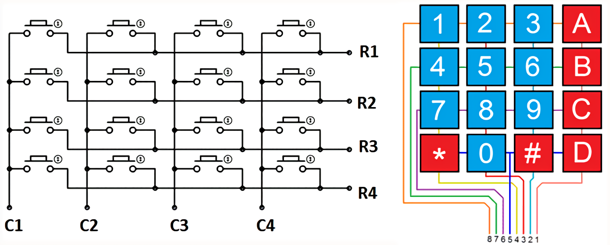

# 4x4 Keypad

## Keypad?



> Keypad: a miniature keyboard or set of buttons for operating a portable electronic device, telephone, or other equipment.

* C = column
* R = row

Sometimes, they use rows as input, columns as output.

Sometimes, they use columns as input, rows as output.

So, you need to do some experiment or check its documents to know how it works.

**We can't use interrupt function to do this job because we can't get a pin input value since we set that pin as an interrupt pin.  \(Maybe this just doesn't work with msp430f169, I don't know\)**

## Coding with interrupt \(failed\)

```c
/*
P2.0-3 need to connected to R1-R4
P2.4-7 need to connected to C1-C4

P1.0 need to connected to a LED
*/

#include<msp430.h>

#define BIT_of_rows (BIT0 | BIT1 | BIT2 | BIT3)
#define BIT_of_columns (BIT4 | BIT5 | BIT6 | BIT7)

#define set_row_as_input P2DIR &= ~BIT_of_rows
#define set_column_as_output P2DIR |= BIT_of_columns

#define set_all_columns_to_0 P2OUT &= ~BIT_of_columns
#define set_all_columns_to_1 P2OUT |= BIT_of_columns

#define enable_interrupt_of_rows P2IE |= BIT_of_rows
#define set_interrupt_edge_to_low_to_high P2IES &= ~BIT_of_rows
#define set_interrupt_edge_to_high_to_low P2IES |= BIT_of_rows

#define set_column1_to_0 P2OUT &= ~BIT4
#define set_column1_to_1 P2OUT |= BIT4

#define set_column2_to_0 P2OUT &= ~BIT5
#define set_column2_to_1 P2OUT |= BIT5

#define set_column3_to_0 P2OUT &= ~BIT6
#define set_column3_to_1 P2OUT |= BIT6

#define set_column4_to_0 P2OUT &= ~BIT7
#define set_column4_to_1 P2OUT |= BIT7

#define input_of_row1 (P2IN & BIT0)
#define input_of_row2 (P2IN & BIT1)
#define input_of_row3 (P2IN & BIT2)
#define input_of_row4 (P2IN & BIT3)

#define interrupt_from_row1 (P2IFG & BIT0)
#define interrupt_from_row2 (P2IFG & BIT1)
#define interrupt_from_row3 (P2IFG & BIT2)
#define interrupt_from_row4 (P2IFG & BIT3)

#define clean_interrupt_flag_of_row1 P2IFG &= ~BIT0
#define clean_interrupt_flag_of_row2 P2IFG &= ~BIT1
#define clean_interrupt_flag_of_row3 P2IFG &= ~BIT2
#define clean_interrupt_flag_of_row4 P2IFG &= ~BIT3

void delay(unsigned int t)
{
    while (t--)
    {
        // delay for 1ms
        __delay_cycles(1000);
    }
}

void light_up_LED()
{
    P1OUT |= BIT0; // Toggle P1.0 using exclusive-OR
}

void light_off_LED()
{
    P1OUT &= ~BIT0; // Toggle P1.0 using exclusive-OR
}

void light_up_or_off_LED()
{
    P1OUT ^= BIT0; // Toggle P1.0 using exclusive-OR
}

int main(void) {
    WDTCTL = WDTPW + WDTHOLD; // Stop watchdog timer

    P1DIR |= BIT0;
    P1OUT &= ~BIT0;

    set_column_as_output;
    set_row_as_input;
    //set_all_columns_to_1;
    set_all_columns_to_0; // by default, columns need to set to low 

    enable_interrupt_of_rows;
    //set_interrupt_edge_to_low_to_high;
    set_interrupt_edge_to_high_to_low; // when you press a key, that row go low

    _BIS_SR(GIE);

    while(1) {
    }
}

#pragma vector = PORT2_VECTOR
__interrupt void Port_2_interrupt_procedure(void)
{
    if (interrupt_from_row1) {
        light_up_LED();

        clean_interrupt_flag_of_row1;
    } else if (interrupt_from_row2) {
        light_off_LED();

        clean_interrupt_flag_of_row2;
    } else if (interrupt_from_row3) {
        light_up_or_off_LED();

        clean_interrupt_flag_of_row3;
    } else if (interrupt_from_row4) {

        clean_interrupt_flag_of_row4;
    }
}
```

## Coding with normal IO

```c
/*
P2.0-3 need to connected to R1-R4
P2.4-7 need to connected to C1-C4

P1.0 need to connected to a LED
*/

#include<msp430.h>

#define BIT_of_rows (BIT0 | BIT1 | BIT2 | BIT3)
#define BIT_of_columns (BIT4 | BIT5 | BIT6 | BIT7)

#define set_row_as_input P2DIR &= ~BIT_of_rows
#define set_column_as_output P2DIR |= BIT_of_columns

#define set_all_columns_to_0 P2OUT &= ~BIT_of_columns
#define set_all_columns_to_1 P2OUT |= BIT_of_columns

#define set_column1_to_0 P2OUT &= ~BIT4
#define set_column1_to_1 P2OUT |= BIT4

#define set_column2_to_0 P2OUT &= ~BIT5
#define set_column2_to_1 P2OUT |= BIT5

#define set_column3_to_0 P2OUT &= ~BIT6
#define set_column3_to_1 P2OUT |= BIT6

#define set_column4_to_0 P2OUT &= ~BIT7
#define set_column4_to_1 P2OUT |= BIT7

#define input_of_row1 (P2IN & BIT0) == 0 // when you pressing a key, it returns 0
#define input_of_row2 (P2IN & BIT1) == 0
#define input_of_row3 (P2IN & BIT2) == 0
#define input_of_row4 (P2IN & BIT3) == 0

void delay(unsigned int t)
{
    while (t--)
    {
        // delay for 1ms
        __delay_cycles(1000);
    }
}

void light_up_LED()
{
    P1OUT |= BIT0; // Toggle P1.0 using exclusive-OR
}

void light_off_LED()
{
    P1OUT &= ~BIT0; // Toggle P1.0 using exclusive-OR
}

void light_up_or_off_LED()
{
    P1OUT ^= BIT0; // Toggle P1.0 using exclusive-OR
}

int catch_keypad_input()
{
    if (input_of_row1) {
        set_column1_to_1;
        if (!input_of_row1) {
            delay(200);
            if (!input_of_row1) {
                light_up_LED();
                set_column1_to_0;
                return 0; // must return, otherwise, a weird thing will happen
            }
        }
        set_column1_to_0;

        set_column2_to_1;
        if (!input_of_row1) {
            delay(200);
            if (!input_of_row1) {
                light_off_LED();
                set_column2_to_0;
                return 0;
            }
        }
        set_column2_to_0;

        set_column3_to_1;
        if (!input_of_row1) {
            delay(200);
            if (!input_of_row1) {
                light_up_or_off_LED();
                set_column3_to_0;
                return 0;
            }
        }
        set_column3_to_0;
        
    } else if (input_of_row2) {
        light_off_LED();

    } else if (input_of_row3) {
        light_up_or_off_LED();
        
    } else if (input_of_row4) {

    }
}

int main(void) {
    WDTCTL = WDTPW + WDTHOLD; // Stop watchdog timer

    P1DIR |= BIT0;
    P1OUT &= ~BIT0;

    set_column_as_output;
    set_row_as_input;
    //set_all_columns_to_1;
    set_all_columns_to_0; // by default, columns need to set to low 

    while(1) {
        catch_keypad_input();
    }
}
```

