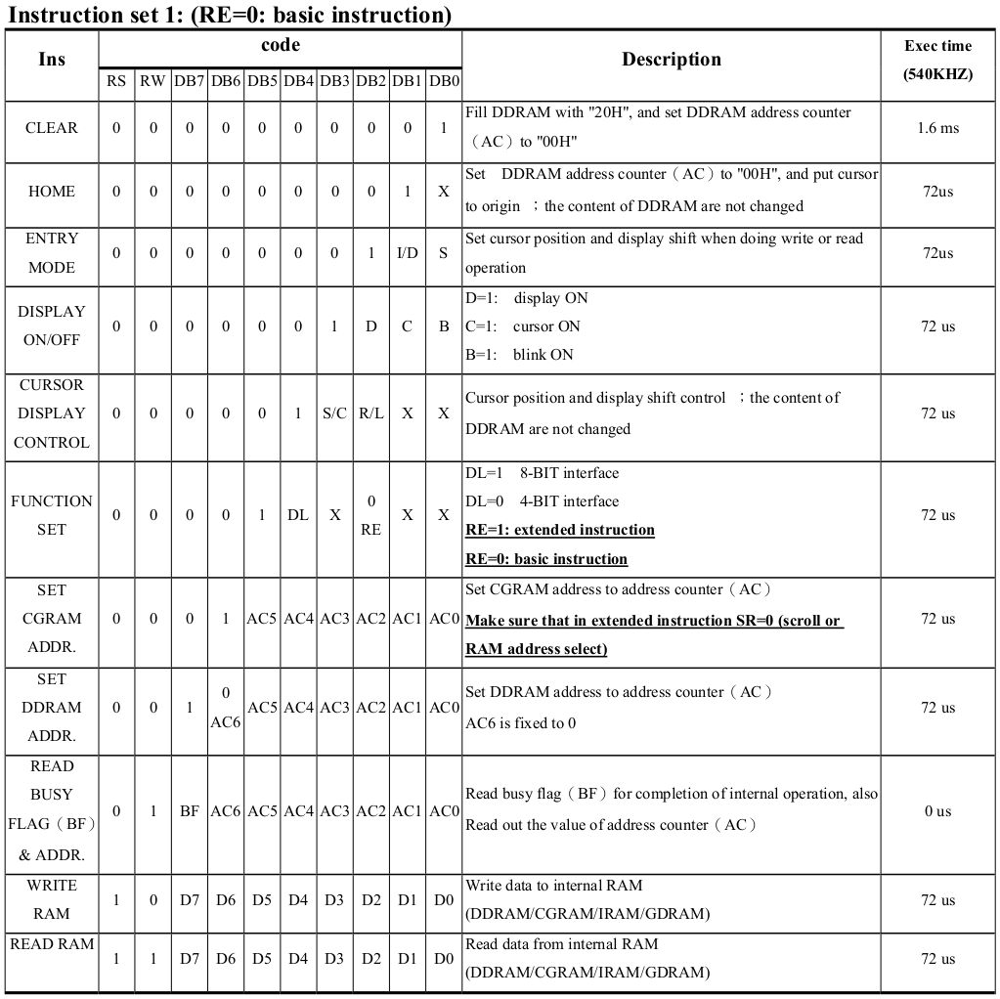
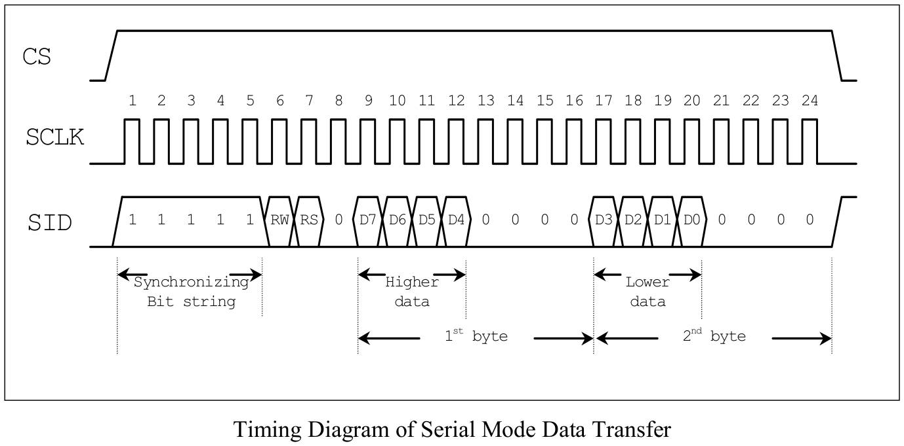

# Liquid-crystal display

## All in all

> LCD: Liquid-crystal display

Here we gonna use `ST7920` \(a LCD which has 128x64 pixels\)

If you use `Arduino` for development, then you should use [u8glib](https://github.com/olikraus/u8glib) to finish this mission as quickly as possible.

## SPI Interface

SPI = Serial Peripheral Interface



To be honest, I don't really know those things.

* Clock \(SPI CLK, SCLK\)
* Chip select \(CS\)
* Master out, slave in \(MOSI\)
* Master in, slave out \(MISO\)

SPI is a synchronous, full duplex master-slave-based interface.

The device that generates the clock signal is called the master. Data transmitted between the master and the slave is synchronized to the clock generated by the master.

SPI interfaces can have only one master and can have one or multiple slaves.

The chip select signal from the master is used to select the slave.

MOSI and MISO are the data lines. MOSI transmits data from the master to the slave and MISO transmits data from the slave to the master.

## ST7920 LCD Pin-Map

<table>
  <thead>
    <tr>
      <th style="text-align:left">Pin Name</th>
      <th style="text-align:left"><b>Description</b>
      </th>
    </tr>
  </thead>
  <tbody>
    <tr>
      <td style="text-align:left">GND</td>
      <td style="text-align:left">Ground</td>
    </tr>
    <tr>
      <td style="text-align:left">VCC</td>
      <td style="text-align:left">Input supply voltage (2.7v to 5.5v, mostly 3.3v)</td>
    </tr>
    <tr>
      <td style="text-align:left">V0</td>
      <td style="text-align:left">LCD bias voltage, for contrast setting</td>
    </tr>
    <tr>
      <td style="text-align:left">RS (CS*)</td>
      <td style="text-align:left">
        <p><b>Parallel Mode</b>: Register Select (write Command or write Data)</p>
        <p>0: Select instruction register (write) or busy flag, address counter (read)</p>
        <p>1: Select data register (write/read).</p>
        <p>(0 for instruction writing, 1 for data writing)</p>
        <p><b>Serial mode</b>: Chip Select</p>
        <p>1: chip enabled</p>
        <p>0: chip disabled.</p>
        <p>(When chip is disabled, SID and SCLK should be set as &#x201C;H&#x201D;
          or &#x201C;L&#x201D;. Transcient of SID and SCLK is not allowed.)</p>
      </td>
    </tr>
    <tr>
      <td style="text-align:left">R/W (SID*)</td>
      <td style="text-align:left">
        <p><b>Parallel Mode</b>: Read/Write control; 0 for write, 1 for read.</p>
        <p><b>Serial Mode</b>: Serial Input Data. (<code>Serial Data Input</code> would
          be better)</p>
      </td>
    </tr>
    <tr>
      <td style="text-align:left">E (SCLK*)</td>
      <td style="text-align:left">
        <p><b>Parallel Mode</b>: Set 1 to Enable LCD, set 0 to disable LCD.</p>
        <p><b>Serial Mode</b>: Serial Clock. (they use this to sync two device, so
          they can transmit binary data bit by bit)</p>
      </td>
    </tr>
    <tr>
      <td style="text-align:left">DB0 - DB7</td>
      <td style="text-align:left">Data Pins (used in <b>parallel mode</b> , 8/4bit)</td>
    </tr>
    <tr>
      <td style="text-align:left">PSB</td>
      <td style="text-align:left">
        <p>Parallel or Serial Binary (Interface selection):</p>
        <p><b>Serial Mode</b>: 0</p>
        <p><b>Parallel Mode</b>: 1</p>
      </td>
    </tr>
    <tr>
      <td style="text-align:left">NC</td>
      <td style="text-align:left">Not connected (Test pins), useless.</td>
    </tr>
    <tr>
      <td style="text-align:left">RST</td>
      <td style="text-align:left">Reset Pin</td>
    </tr>
    <tr>
      <td style="text-align:left">VOUT</td>
      <td style="text-align:left">LCD voltage doubler output. VOUT &#x2266; 7V.</td>
    </tr>
    <tr>
      <td style="text-align:left">BLA</td>
      <td style="text-align:left">Backlight(Background brightness) positive power supply. (3.3V or 5V)</td>
    </tr>
    <tr>
      <td style="text-align:left">BLK</td>
      <td style="text-align:left">Backlight(Background brightness) Negative power supply. (0V or Ground)</td>
    </tr>
  </tbody>
</table>

If anyone tries to say `bit` in computer science, that means `0 or 1`.

## What's the difference between Parallel Mode and Serial Mode?

At High-level programming language, `Parallel Mode` will have better transfer performance.

### Parallel Mode:

You send data through multiple wire at the same time.

At here, I mean use `ST7920 LCD`, you have to connect `DB0 - DB7` to your `MSP430 board` .

### Serial Mode:

You send data just through one wire. Data will be sent one by one with time passing.

At here, I mean use `ST7920 LCD`, you will use Pin `CS(RS), SID(R/W), SCLK(E), PSB`.

## Complaint

Chinese are so \*\*! \(What should I say? stupid or selfishness?\)

Almost every LCD chip they have created is copied from other countries.

But they never say a word about its copyright or where it came from. You can't even know the original chip name from those product made in China.

For example, `ST7920 LCD`, in China `Taobao` store, you can only search it by typing `12864LCD`. They even treat `12864LCD` as a type of LCD. But we both know it's nothing but a screen resolution.

## Bad Codes \(It's written by Chinese people in the first place\)

```c
#include  "msp430.h"

#define CS1 P1OUT |= BIT0 //RS
#define CS0 P1OUT &= BIT0
#define SID1 P1OUT |= BIT1 //R/W
#define SID0 P1OUT &= ~BIT1
#define SCLK1 P1OUT |= BIT2 //E
#define SCLK0 P1OUT &= ~BIT2
// PSB connect to ground

void delay_1ms(unsigned char t)
{
    while (t--)
    {
        // delay for 1ms
        __delay_cycles(1000);
    }
}

void sendbyte(unsigned char zdata)
{
    unsigned int i;

    for (i = 0; i < 8; i++)
    {
        //1111 1000 & 1000 0000 = 1000 0000 = True
        //1111 0000 & 1000 0000 = 1000 0000 = True
        //1110 0000 & 1000 0000 = 1000 0000 = True
        //...
        //0000 0000 & 1000 0000 = 0000 0000 = False
        if ((zdata << i) & 0x80)
        {
            SID1;
        }
        else
        {
            SID0;
        }
        SCLK0;
        SCLK1;
    }
}

void write_command(unsigned char cmdcode)
{
    CS1;
    sendbyte(0xf8);
    //f8=1111 1000; if (DB0-7 = 1111 1000), then SET FUNCTION; if you have any question, check ST7920V30_eng.pdf
    sendbyte(cmdcode & 0xf0);
    //f0=1111 0000; 30=0011 0000; 1111 0000 & 0011 0000 = 0011 0000; DISPLAY ON
    //f0=1111 0000; 0c=0000 1100; 1111 0000 & 0000 1100 = 0000 0000; Useless
    //f0=1111 0000; 01=0000 0001; 1111 0000 & 0000 0001 = 0000 0000; Useless
    sendbyte((cmdcode << 4) & 0xf0);
    //0000 0000 & 1111 0000 = 0000 0000; Useless
    //1100 0000 & 1111 0000 = 1100 0000; HOME (put cursor to origin)
    //0001 0000 & 1111 0000 = 0001 0000; display, cursor, blink OFF
    delay_1ms(1);
    CS0;
}

void write_data(unsigned char Dispdata)
{
    CS1;
    sendbyte(0xfa);
    sendbyte(Dispdata & 0xf0);
    sendbyte((Dispdata << 4) & 0xf0);
    delay_1ms(1);
    CS0;
}

void Put_String(unsigned int x, unsigned int y, unsigned char* s)
{
    switch (y)
    {
    case 1:
        write_command(0x80 + x);
        break;
    case 2:
        write_command(0x90 + x);
        break;
    case 3:
        write_command(0x88 + x);
        break;
    case 4:
        write_command(0x98 + x);
        break;
    default:
        break;
    }
    while (*s > 0)
    {
        write_data(*s);
        s++;
        delay_1ms(1);
    }
}

void lcdinit()
{
    delay_1ms(1000);  // delay for LCD to wake up

    write_command(0x30);  // 30=0011 0000; DISPLAY ON
    delay_1ms(20);
    write_command(0x0c);  // 0c=0000 1100; HOME(put cursor to origin)
    delay_1ms(20);
    //write_command(0x01);  // 01=0000 0001; display, cursor, blink OFF
    delay_1ms(200);
}

int main(void)
{
    WDTCTL = WDTPW + WDTHOLD; // close watchdog
    P1DIR = 0xFF;
    P1OUT = 0x00;

    lcdinit();

    while (1)
    {
        Put_String(0, 1, "Hello, World!");
        Put_String(0, 2, "My name is yingshaoxo.");
    }
}
```

## Things you should know before you write your own LCD program



**DDRAM** - stands for "Data Display Random Access Memory" and is the working data buffer of the display. Each character on the display has a corresponding **DDRAM** location and the byte loaded in **DDRAM** controls which character is displayed. 

**ENTRY MODE:** typing mode

**MPU**: Micro-processing Unit

> ST7920 is in serial interface mode when pull down PSB pin. Two pins \(SCLK and SID\) are used to complete the data transfer. Only write data is available. 
>
> When connecting several ST7920, chip select\(CS\)must be used. Only when\(CS\)is high the serial clock\(SCLK\)can be accepted. On the other hand, when chip select\(CS\)is low ST7920 serial counter and data will be reset. Transmission will be terminated and data will be cleared. Serial transfer counter is set to the first bit. For a minimal system with only one ST7920 and one MPU, only SCLK and SID pins are necessary. CS pin should pull to high.
>
> ST7920’s serial clock \(SCLK\) is asynchronous to the internal clock and is generated by MPU. When multiple instruction/data is transferred instruction execution time must be considered. Must wait for the previous instruction to finish before sending the next. ST7920 has no internal instruction buffer area.
>
> When starting a transmission a start byte is required. It consists of 5 consecutive 〝1〞\(sync character\). Serial transfer counter will be reset and synchronized. Following 2 bits for read/write \( RW\) and register/data select \(RS\) . Last 4 bits is filled by 〝0〞 。
>
> After receiving the sync character and RW and RS bits, every 8 bits instruction/data will be separated into 2 groups. Higher 4 bits\(DB7~DB4\)will be placed in first section followed by 4 "0". And lower 4bits\(DB3~DB0\) will be placed in second section followed by 4 "0".



## Good Codes \(It was written by me\)

```c
#include "msp430.h"

#define CS1 P1OUT |= BIT0 //RS
#define CS0 P1OUT &= BIT0
#define SID1 P1OUT |= BIT1 //R/W
#define SID0 P1OUT &= ~BIT1
#define SCLK1 P1OUT |= BIT2 //E
#define SCLK0 P1OUT &= ~BIT2
// PSB connect to ground since we only use serial transition mode

//data=00001100, always remember it's "d7 d6 d5 d4 d3 d2 d1 d0"
//if you need to know how to set d7-d0, just check ST7920V30_eng.pdf

#define chip_select_1 CS1 //RS
#define chip_select_0 CS0
#define serial_data_input_1 SID1 //R/W
#define serial_data_input_0 SID0
#define serial_clock_1 SCLK1 //E
#define serial_clock_0 SCLK0

void delay(unsigned int t)
{
    while (t--)
    {
        // delay for 1ms
        __delay_cycles(1000);
    }
}

void send_byte(unsigned char eight_bits)
{
    unsigned int i;

    for (i = 0; i < 8; i++)
    {
        //1111 1000 & 1000 0000 = 1000 0000 = True
        //1111 0000 & 1000 0000 = 1000 0000 = True
        //1110 0000 & 1000 0000 = 1000 0000 = True
        //...
        //0000 0000 & 1000 0000 = 0000 0000 = False
        //The main purpose for this is to send a series of binary number from left to right
        if ((eight_bits << i) & 0x80)
        {
            serial_data_input_1;
        }
        else
        {
            serial_data_input_0;
        }
        // We use this to simulate clock:
        serial_clock_0;
        serial_clock_1;
    }
}

void write_command(unsigned char command)
{
    chip_select_1;

    send_byte(0xf8);
    /*
    f8=1111 1000;
    send five 1 first, so LCD will papare for receiving data; 
    then R/W = 0, RS = 0; 
    when RS = 0, won't write d7-d0 to RAM
    */
    send_byte(command & 0xf0);        //send d7-d4
    send_byte((command << 4) & 0xf0); //send d3-d0
    /*
    f0 = 1111 0000

    if character = 1100 0011
    first send 1100 0000 (d7-d4 0000)
    then send 0011 0000 (d3-d0 0000)
    */

    delay(1);
    chip_select_0; // when chip_select from 1 to 0, serial counter and data will be reset
}

void write_data(unsigned char character)
{
    chip_select_1;

    send_byte(0xfa);
    /*
    fa=1111 1010; 

    send five 1 first, so LCD will papare for receiving data; 
    then R/W = 0, RS = 1; 
    when RS = 1, write d7-d0 to RAM
    */
    send_byte(character & 0xf0);        //send d7-d4
    send_byte((character << 4) & 0xf0); //send d3-d0
    /*
    f0 = 1111 0000

    if character = 1100 0011
    first send 1100 0000 (d7-d4 0000)
    then send 0011 0000 (d3-d0 0000)
    */

    delay(1);
    chip_select_0;
}

void print_string(unsigned int x, unsigned int y, unsigned char *string)
{
    switch (y)
    {
    case 1:
        write_command(0x80 + x);
        break;
    case 2:
        write_command(0x90 + x);
        break;
    case 3:
        write_command(0x88 + x);
        break;
    case 4:
        write_command(0x98 + x);
        break;
    default:
        break;
    }

    while (*string > 0)
    {
        write_data(*string);
        string++;
        delay(1);
    }
}

void initialize_LCD()
{
    delay(1000); // delay for LCD to wake up

    write_command(0x30); // 30=0011 0000; use `basic instruction mode`, use `8-BIT interface`
    delay(20);
    write_command(0x0c); // 0c=0000 1100; DISPLAY ON, cursor OFF, blink OFF
    delay(20);
    write_command(0x01); // 0c=0000 0001; CLEAR

    delay(200);
}

int main(void)
{
    WDTCTL = WDTPW + WDTHOLD; // close watchdog
    P1DIR = 0xFF;
    P1OUT = 0x00;

    unsigned char yingshaoxo[] = {
        0xBA, 0xFA,
        0xD3, 0xA2,
        0xBD, 0xDC,
        0x00
    };

    initialize_LCD();

    while (1)
    {
        print_string(0, 1, "Hello, world!");
        print_string(0, 2, "My name is: ");
        print_string(0, 3, yingshaoxo);
        print_string(0, 4, ".");
    }
}
```

You really should look at those comments I made, it's very important for you to understand what's going on with the above codes.

If you want to display Non-English words, you have to use a third-party string tool. Here I made one by myself: 

```python
from textwrap import wrap

while 1:
    string = input("\nEnter any Chinese characters here: ")
    if (string.strip() != "") or string.count(" ") > 0:
        try:
            whole_hex_string = string.encode("gb2312").hex()
            print(whole_hex_string)
            result_list = wrap(whole_hex_string, 2)

            template_start = "unsigned char gb2312_string[] = {"
            template_center = ", ".join([f"0x{s}" for s in result_list]) + ", 0x00"
            template_end = "};"
            print(template_start + template_center + template_end)
        except Exception as e:
            print(e)

"""
while 1:
    string = input("\nEnter any Chinese characters here: ")
    if (string.strip() != "") or string.count(" ") > 0:
        try:
            result_list = []
            for char in string:
                hex_string = char.encode("gb2312").hex()
                hex1 = hex_string[:2]
                if hex1 != "":
                    result_list.append(hex1)
                else:
                    result_list.append("00")
                hex2 = hex_string[2:]
                if hex2 != "":
                    result_list.append(hex2)
                else:
                    result_list.append("00")

            template_start = "unsigned char gb2312_string[] = {"
            template_center = ", ".join([f"0x{s}" for s in result_list]) + ", 0x00"
            template_end = "};"
            print(template_start + template_center + template_end)
        except Exception as e:
            print(e)
"""

```

## References:









