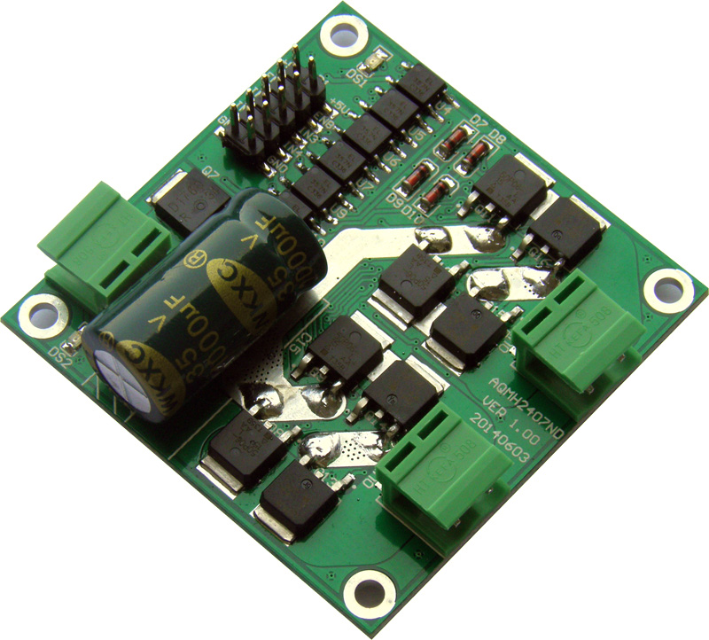
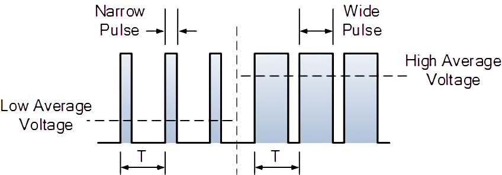

# Motor Driver

## Introduction

`Motor Driver` is a device that you have to use to drive your motor by micro-controller's pin output.

In here, we gonna use `AQMH2407ND`. It's made by Chinese probably. 



It got three pins:

* In1 \(input 1\)
* In2 \(input 2\)
* En \(enable\)

| Input 1 | Input 2 | Enable | Function |
| :--- | :--- | :--- | :--- |
| 0 | 0 | whatever | stop |
| 1 | 1 | whatever | still |
| 1 | 0 | \(0, 1\] or PWM | forward |
| 0 | 1 | \(0, 1\] or PWM | backward |

`(0, 1]` means how long you set `Enable pin` to 1 during a period of time. For example, if we set `Enable pin` to `1` remaining 0.5 second, then set `Enable pin` to `0` remaining another 0.5 second, do this over and over again. In the end, we'll get an average speed for our motor. 

**PWM**: Pulse Width Modulated Waveform. It's kind of like `WriteAnalog(0-255)` in Arduino, but you have to do it by yourself.



## Codes without Speed Control

```c
#include <msp430.h>

#define pin_of_motor1_driver_input1 BIT0
#define pin_of_motor1_driver_input2 BIT1
#define pin_of_motor1_driver_enable BIT2 // to give the power to the circuit

#define pin_of_motor2_driver_input1 BIT3
#define pin_of_motor2_driver_input2 BIT4
#define pin_of_motor2_driver_enable BIT5 // to give the power to the circuit

#define set_all_motor_pin_as_output                                            \
    P3DIR |= (pin_of_motor1_driver_input1 | pin_of_motor1_driver_input2 |      \
              pin_of_motor1_driver_enable | pin_of_motor2_driver_input1 |      \
              pin_of_motor2_driver_input2 | pin_of_motor2_driver_enable)

#define set_pin_of_motor1_driver_input1_to_0                                   \
    P3OUT &= ~pin_of_motor1_driver_input1 // P3 means Port3, and Port3 has 8
                                          // pins from P3.0 to P3.7
#define set_pin_of_motor1_driver_input1_to_1                                   \
    P3OUT |= pin_of_motor1_driver_input1 // P3 means Port3, and Port3 has 8 pins
                                         // from P3.0 to P3.7
#define set_pin_of_motor1_driver_input2_to_0                                   \
    P3OUT &= ~pin_of_motor1_driver_input2 // P3 means Port3, and Port3 has 8
                                          // pins from P3.0 to P3.7
#define set_pin_of_motor1_driver_input2_to_1                                   \
    P3OUT |= pin_of_motor1_driver_input2 // P3 means Port3, and Port3 has 8 pins
                                         // from P3.0 to P3.7
#define set_pin_of_motor1_driver_enable_to_0                                   \
    P3OUT &= ~pin_of_motor1_driver_enable // P3 means Port3, and Port3 has 8
                                          // pins from P3.0 to P3.7
#define set_pin_of_motor1_driver_enable_to_1                                   \
    P3OUT |= pin_of_motor1_driver_enable // P3 means Port3, and Port3 has 8 pins
                                         // from P3.0 to P3.7

#define set_pin_of_motor2_driver_input1_to_0                                   \
    P3OUT &= ~pin_of_motor2_driver_input1 // P3 means Port3, and Port3 has 8
                                          // pins from P3.0 to P3.7
#define set_pin_of_motor2_driver_input1_to_1                                   \
    P3OUT |= pin_of_motor2_driver_input1 // P3 means Port3, and Port3 has 8 pins
                                         // from P3.0 to P3.7
#define set_pin_of_motor2_driver_input2_to_0                                   \
    P3OUT &= ~pin_of_motor2_driver_input2 // P3 means Port3, and Port3 has 8
                                          // pins from P3.0 to P3.7
#define set_pin_of_motor2_driver_input2_to_1                                   \
    P3OUT |= pin_of_motor2_driver_input2 // P3 means Port3, and Port3 has 8 pins
                                         // from P3.0 to P3.7
#define set_pin_of_motor2_driver_enable_to_0                                   \
    P3OUT &= ~pin_of_motor2_driver_enable // P3 means Port3, and Port3 has 8
                                          // pins from P3.0 to P3.7
#define set_pin_of_motor2_driver_enable_to_1                                   \
    P3OUT |= pin_of_motor2_driver_enable // P3 means Port3, and Port3 has 8 pins
                                         // from P3.0 to P3.7

void millisecond_level_of_delay(unsigned int t) {
    while (t--) {
        // delay for 1ms
        __delay_cycles(1000);
    }
}

void stop_motor(int which_motor) {
    if (which_motor == 1) {
        set_pin_of_motor1_driver_input1_to_0;
        set_pin_of_motor1_driver_input2_to_0;
    } else if (which_motor == 2) {
        set_pin_of_motor2_driver_input1_to_0;
        set_pin_of_motor2_driver_input2_to_0;
    }
}

void make_the_motor_still(int which_motor) {
    if (which_motor == 1) {
        set_pin_of_motor1_driver_input1_to_1;
        set_pin_of_motor1_driver_input2_to_1;
    } else if (which_motor == 2) {
        set_pin_of_motor2_driver_input1_to_1;
        set_pin_of_motor2_driver_input2_to_1;
    }
}

void motor_forward(int which_motor, int speed) {
    if (which_motor == 1) {
        set_pin_of_motor1_driver_input1_to_1;
        set_pin_of_motor1_driver_input2_to_0;

        set_pin_of_motor1_driver_enable_to_1;
    } else if (which_motor == 2) {
        set_pin_of_motor2_driver_input1_to_1;
        set_pin_of_motor2_driver_input2_to_0;

        set_pin_of_motor2_driver_enable_to_1;
    }
}

void motor_backward(int which_motor, int speed) {
    if (which_motor == 1) {
        set_pin_of_motor1_driver_input1_to_0;
        set_pin_of_motor1_driver_input2_to_1;

        set_pin_of_motor1_driver_enable_to_1;
    } else if (which_motor == 2) {
        set_pin_of_motor2_driver_input1_to_0;
        set_pin_of_motor2_driver_input2_to_1;

        set_pin_of_motor2_driver_enable_to_1;
    }
}

int main(void) {
    WDTCTL = WDTPW | WDTHOLD; // stop watchdog timer

    set_all_motor_pin_as_output;

    while (1) {
        motor_forward(1, 255);
        millisecond_level_of_delay(2 * 1000);
        stop_motor(1);
        millisecond_level_of_delay(2 * 1000);
        motor_backward(1, 255);
        millisecond_level_of_delay(2 * 1000);
    }

    return 0;
}
```

## Codes with PWM speed control

### A simple demo demonstrated how PWM works in MSP430

```c
#include <msp430.h>

int main(void) {
    WDTCTL = WDTPW + WDTHOLD; // Stop WDT

    // Why I choose the following pins? Because the pin-map says they are TACLK(TA0-2) pin.
    P1DIR |= (BIT6 | BIT7);   // P1.6 and P1.6 output
    P1SEL |= (BIT6 | BIT7);   // Select pins to use Peripheral module function; P1.6 and P1.6 TA1/2 otions

    TACCR0 = 1000 - 1;          // Timer A Capture/Compare 0; PWM Period, for 1 MHz, 1000 means 1 ms. 1ms != 1us.

    TACCTL1 = OUTMOD_7;         // Timer A Capture/Compare Control 1; CCR1 reset/set
    TACCR1 = 800;               // Timer A Capture/Compare 1; CCR1 PWM duty cycle, output 80% Power
    
    TACCTL2 = OUTMOD_7;         // Timer A Capture/Compare Control 2; CCR2 reset/set
    TACCR2 = 500;               // Timer A Capture/Compare 2; CCR2 PWM duty cycle, output 50% Power

    TACTL = TASSEL_2 + MC_1;  // use SMCLK as source clock; count in UP mode
}
```

#### Point 1

```text
#define OUTMOD_0               (0*0x20u)      /* PWM output mode: 0 - output only */
#define OUTMOD_1               (1*0x20u)      /* PWM output mode: 1 - set */
#define OUTMOD_2               (2*0x20u)      /* PWM output mode: 2 - PWM toggle/reset */
#define OUTMOD_3               (3*0x20u)      /* PWM output mode: 3 - PWM set/reset */
#define OUTMOD_4               (4*0x20u)      /* PWM output mode: 4 - toggle */
#define OUTMOD_5               (5*0x20u)      /* PWM output mode: 5 - Reset */
#define OUTMOD_6               (6*0x20u)      /* PWM output mode: 6 - PWM toggle/set */
#define OUTMOD_7               (7*0x20u)      /* PWM output mode: 7 - PWM reset/set */
```

Set: from 0 to 1

Reset: from 1 to 0

Toggle: inverse the value

OUTMOD\_7: The output is reset when the timer counts to the TACCRx value. It is set when the timer counts to the TACCR0 value.

#### Point 2

Only when you set `P1SEL to 1 (select peripheral function as pin function)`, then the `square pulse` will be generated from that pin.

#### Point 3

Different `TACCTL(Timer A Capture/Compare Control)` can set different `OUTMOD(output mode)`. 

Then you have to set different `TACCR(Timer A Capture/Compare)` to generate different `square pulse`.

> You could visit the `MSP430F169 Users Guide.pdf` to get more information.

### Combined with Motor Driver

```c
#include <msp430.h>

#define pin_of_motor1_driver_input1 BIT1
#define pin_of_motor1_driver_input2 BIT2

#define pin_of_motor2_driver_input1 BIT3
#define pin_of_motor2_driver_input2 BIT4

#define pin_of_motor1_driver_enable BIT6 // to give the power to the circuit
#define pin_of_motor2_driver_enable BIT7 // to give the power to the circuit

#define set_motor_control_pin_as_output P3DIR |= (pin_of_motor1_driver_input1 | pin_of_motor1_driver_input2 | pin_of_motor2_driver_input1 | pin_of_motor2_driver_input2)
#define set_motor_enable_pin_as_output P1DIR |= (pin_of_motor1_driver_enable | pin_of_motor2_driver_enable)

#define set_pin_of_motor1_driver_input1_to_0 \
    P3OUT &= ~pin_of_motor1_driver_input1 // P3 means Port3, and Port3 has 8 \
                                          // pins from P3.0 to P3.7
#define set_pin_of_motor1_driver_input1_to_1 \
    P3OUT |= pin_of_motor1_driver_input1 // P3 means Port3, and Port3 has 8 pins \
                                         // from P3.0 to P3.7
#define set_pin_of_motor1_driver_input2_to_0 \
    P3OUT &= ~pin_of_motor1_driver_input2 // P3 means Port3, and Port3 has 8 \
                                          // pins from P3.0 to P3.7
#define set_pin_of_motor1_driver_input2_to_1 \
    P3OUT |= pin_of_motor1_driver_input2 // P3 means Port3, and Port3 has 8 pins \
                                         // from P3.0 to P3.7

#define set_pin_of_motor2_driver_input1_to_0 \
    P3OUT &= ~pin_of_motor2_driver_input1 // P3 means Port3, and Port3 has 8 \
                                          // pins from P3.0 to P3.7
#define set_pin_of_motor2_driver_input1_to_1 \
    P3OUT |= pin_of_motor2_driver_input1 // P3 means Port3, and Port3 has 8 pins \
                                         // from P3.0 to P3.7
#define set_pin_of_motor2_driver_input2_to_0 \
    P3OUT &= ~pin_of_motor2_driver_input2 // P3 means Port3, and Port3 has 8 \
                                          // pins from P3.0 to P3.7
#define set_pin_of_motor2_driver_input2_to_1 \
    P3OUT |= pin_of_motor2_driver_input2 // P3 means Port3, and Port3 has 8 pins \
                                         // from P3.0 to P3.7

unsigned int a_period_of_time = 1000 - 1;

void millisecond_level_of_delay(unsigned int t) {
    while (t--) {
        // delay for 1ms
        __delay_cycles(1000);
    }
}

void update_motor_speed(int which_motor, float speed) {
    if (which_motor == 1) {
        TACCR1 = (int)(a_period_of_time * speed);
    } else if (which_motor == 2) {
        TACCR2 = (int)(a_period_of_time * speed);
    }
}

void initialize_motor_driver() {
    set_motor_control_pin_as_output;
    set_motor_enable_pin_as_output;

    P1SEL |= (pin_of_motor1_driver_enable | pin_of_motor2_driver_enable); // Peripheral module function is selected for the pin 1.6 and pin 1.7

    TACCR0 = a_period_of_time;

    TACCTL1 = OUTMOD_7; //Timer A Capture/Compare Control 1; PWM output mode: 7 - PWM reset/set
    update_motor_speed(1, 0);

    TACCTL2 = OUTMOD_7; //Timer A Capture/Compare Control 2; PWM output mode: 7 - PWM reset/set
    update_motor_speed(2, 0);

    TACTL = TASSEL_2 + MC_1; // Timer A Control (control all); SMCLK Clock = 1MHz; Up mode, count from 0 to TACCR1
}

void stop_motor(int which_motor) {
    if (which_motor == 1) {
        set_pin_of_motor1_driver_input1_to_0;
        set_pin_of_motor1_driver_input2_to_0;
    } else if (which_motor == 2) {
        set_pin_of_motor2_driver_input1_to_0;
        set_pin_of_motor2_driver_input2_to_0;
    }

    update_motor_speed(1, 0);
    update_motor_speed(2, 0);
}

void make_the_motor_still(int which_motor) {
    if (which_motor == 1) {
        set_pin_of_motor1_driver_input1_to_1;
        set_pin_of_motor1_driver_input2_to_1;
    } else if (which_motor == 2) {
        set_pin_of_motor2_driver_input1_to_1;
        set_pin_of_motor2_driver_input2_to_1;
    }
}

void motor_forward(int which_motor, float speed) {
    if (which_motor == 1) {
        set_pin_of_motor1_driver_input1_to_1;
        set_pin_of_motor1_driver_input2_to_0;
    } else if (which_motor == 2) {
        set_pin_of_motor2_driver_input1_to_1;
        set_pin_of_motor2_driver_input2_to_0;
    }

    update_motor_speed(which_motor, speed);
}

void motor_backward(int which_motor, float speed) {
    if (which_motor == 1) {
        set_pin_of_motor1_driver_input1_to_0;
        set_pin_of_motor1_driver_input2_to_1;
    } else if (which_motor == 2) {
        set_pin_of_motor2_driver_input1_to_0;
        set_pin_of_motor2_driver_input2_to_1;
    }

    update_motor_speed(which_motor, speed);
}

int main(void) {
    WDTCTL = WDTPW | WDTHOLD; // stop watchdog timer

    initialize_motor_driver();

    while (1) {
        millisecond_level_of_delay(2 * 1000);
        motor_forward(1, 0.5);
        millisecond_level_of_delay(2 * 1000);
        motor_forward(1, 0.2);
        millisecond_level_of_delay(2 * 1000);
        stop_motor(1);
        millisecond_level_of_delay(2 * 1000);

        /*
        motor_forward(2, 1);
        millisecond_level_of_delay(1 * 1000);
        motor_forward(2, 0.5);
        millisecond_level_of_delay(1 * 1000);
        stop_motor(2);
        millisecond_level_of_delay(1 * 1000);
         */
    }

    return 0;
}
```

## References:

```text
http://www.ece.utep.edu/courses/web3376/Notes_files/ee3376-timer.ppt.pdf

http://www.akelc.com/download/show_67.html

Made by yingshaoxo
```

