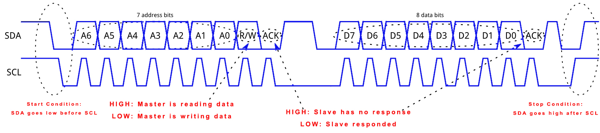

# MPU-6050

## Introduction

### The Shape of that Chip

The InvenSense MPU-6050 sensor contains a MEMS accelerometer and a MEMS gyro in a single chip.

> MPU: Micro Processor Unit

> MEMS: _Micro Electro Mechanical Systems_


> I2C: Inter-Integrated Circuit

> GY52 or GY521 is Breakout Board. Don't ask me what is Breakout Board, I don't know either.

When this device stays still, the raw value you read from accelerometer or gyro will be a constant value. But when you move that device fast, the accelerometer will return an unstable value compare to the gyro. By the way, they all return x,y,z values.

### I2C \(Inter-Integrated Circuit\)

I²C, pronounced I-squared-C, is a synchronous, multi-master, multi-slave, packet switched, single-ended, serial computer bus invented in 1982 by Philips Semiconductor. It is widely used for attaching lower-speed peripheral ICs to processors and micro-controllers in short-distance, intra-board communication.



## Communication Protocol

USART: Universal Synchronous Asynchronous Receiver Transmitter

Here we use `I2C protocol`, it's different than `SPI protocol`.

There has a lot of details about how to configure I2C in `MSP430 User Guide.pdf`. You just have to search keyword like `I2C Mode` to get it.

## I2C code1 \(Failed to get any data\)

```c
#include <msp430.h>
#include <stdio.h>
#include <stdlib.h>
#include <string.h>

// ***************
// ****************
// SET LCD!!!!!!!!!!!!!!!!!!!!!!!!!!!!!!!!!!!!!!!
// RS: P1.0
// R/W: P1.1
// E: P1.2
// ***************
// ****************
#define CS1 P1OUT |= BIT0 // RS
#define CS0 P1OUT &= BIT0
#define SID1 P1OUT |= BIT1 // R/W
#define SID0 P1OUT &= ~BIT1
#define SCLK1 P1OUT |= BIT2 // E
#define SCLK0 P1OUT &= ~BIT2
// PSB connect to ground since we only use serial transition mode

// data=00001100, always remember it's "d7 d6 d5 d4 d3 d2 d1 d0"
// if you need to know how to set d7-d0, just check ST7920V30_eng.pdf

#define chip_select_1 CS1 // RS
#define chip_select_0 CS0
#define serial_data_input_1 SID1 // R/W
#define serial_data_input_0 SID0
#define serial_clock_1 SCLK1 // E
#define serial_clock_0 SCLK0

void millisecond_of_delay(unsigned int t) {
    while (t--) {
        // delay for 1ms
        __delay_cycles(1000);
    }
}

void send_byte(unsigned char eight_bits) {
    unsigned int i;

    for (i = 0; i < 8; i++) {
        // 1111 1000 & 1000 0000 = 1000 0000 = True
        // 1111 0000 & 1000 0000 = 1000 0000 = True
        // 1110 0000 & 1000 0000 = 1000 0000 = True
        //...
        // 0000 0000 & 1000 0000 = 0000 0000 = False
        // The main purpose for this is to send a series of binary number from
        // left to right
        if ((eight_bits << i) & 0x80) {
            serial_data_input_1;
        } else {
            serial_data_input_0;
        }
        // We use this to simulate clock:
        serial_clock_0;
        serial_clock_1;
    }
}

void write_command(unsigned char command) {
    chip_select_1;

    send_byte(0xf8);
    /*
    f8=1111 1000;
    send five 1 first, so LCD will papare for receiving data;
    then R/W = 0, RS = 0;
    when RS = 0, won't write d7-d0 to RAM
    */
    send_byte(command & 0xf0);        // send d7-d4
    send_byte((command << 4) & 0xf0); // send d3-d0
    /*
    f0 = 1111 0000

    if character = 1100 0011
    first send 1100 0000 (d7-d4 0000)
    then send 0011 0000 (d3-d0 0000)
    */

    millisecond_of_delay(1);
    chip_select_0; // when chip_select from 1 to 0, serial counter and data will
                   // be reset
}

void write_data(unsigned char character) {
    chip_select_1;

    send_byte(0xfa);
    /*
    fa=1111 1010;

    send five 1 first, so LCD will papare for receiving data;
    then R/W = 0, RS = 1;
    when RS = 1, write d7-d0 to RAM
    */
    send_byte(character & 0xf0);        // send d7-d4
    send_byte((character << 4) & 0xf0); // send d3-d0
    /*
    f0 = 1111 0000

    if character = 1100 0011
    first send 1100 0000 (d7-d4 0000)
    then send 0011 0000 (d3-d0 0000)
    */

    millisecond_of_delay(1);
    chip_select_0;
}

void print_string(unsigned int x, unsigned int y, unsigned char *string) {
    switch (y) {
    case 1:
        write_command(0x80 + x);
        break;
    case 2:
        write_command(0x90 + x);
        break;
    case 3:
        write_command(0x88 + x);
        break;
    case 4:
        write_command(0x98 + x);
        break;
    default:
        break;
    }

    while (*string > 0) {
        write_data(*string);
        string++;
        millisecond_of_delay(1);
    }
}

void print_number(int x, int y, long int number) {
    char text[20];
    sprintf(text, "%d", number);
    print_string(x, y, text);
}

void reverse_a_string_with_certain_length(char *str, int len) {
    int i = 0, j = len - 1, temp;
    while (i < j) {
        temp = str[i];
        str[i] = str[j];
        str[j] = temp;
        i++;
        j--;
    }
}

int int_to_string(int x, char str[], int d) {
    int i = 0;
    while (x) {
        str[i++] = (x % 10) + '0';
        x = x / 10;
    }

    // If number of digits required is more, then
    // add 0s at the beginning
    while (i < d)
        str[i++] = '0';

    reverse_a_string_with_certain_length(str, i);
    str[i] = '\0';
    return i;
}

void float_to_string(float n, char *res, int afterpoint) {
    // Extract integer part
    int ipart = (int)n;

    // Extract floating part
    float fpart = n - (float)ipart;

    // convert integer part to string
    int i = int_to_string(ipart, res, 0);

    // check for display option after point
    if (afterpoint != 0) {
        res[i] = '.'; // add dot

        // Get the value of fraction part upto given no.
        // of points after dot. The third parameter is needed
        // to handle cases like 233.007
        int power = 1;
        int count_num = 0;
        for (; count_num < afterpoint; count_num++) {
            power = power * 10;
        }
        fpart = fpart * power;

        int_to_string((int)fpart, res + i + 1, afterpoint);
    }
}

void print_float(int x, int y, float number) {
    char text[20];
    if (number < 0) {
        number = -number;
        char text2[20];
        strcpy(text, "-");
        float_to_string(number, text2, 4);
        strcat(text, text2);
    } else {
        float_to_string(number, text, 4);
    }
    print_string(x, y, text);
}

void screen_clean() {
    write_command(0x01);
}

void initialize_LCD() {
    P1DIR = 0xFF;
    P1OUT = 0x00;

    millisecond_of_delay(1000); // delay for LCD to wake up

    write_command(0x30); // 30=0011 0000; use `basic instruction mode`, use
                         // `8-BIT interface`
    millisecond_of_delay(20);
    write_command(0x0c); // 0c=0000 1100; DISPLAY ON, cursor OFF, blink OFF
    millisecond_of_delay(20);
    write_command(0x01); // 0c=0000 0001; CLEAR

    millisecond_of_delay(200);
}

// ***************
// ****************
// SET MPU6050!!!!!!!!!!!!!!!!!!!!!!!!!!!!!!!!!!!!!!!
//
// SDA(Serial Data): P3.6
// SCL(Serial Clock): P3.7
// if AD0 = VCC, the slave address become 1101001; 0x69 = 01101001
// if AD0 = 0V, the slave address become 1101000; 0x68 = 01101000
//
// ***************
// ****************

#include <math.h>

#define SDA_pin BIT6
#define SCL_pin BIT7

//****************************************

// 定义MPU6050内部地址

//****************************************

#define SMPLRT_DIV 0x19   //陀螺仪采样率，典型值：0x07(125Hz)
#define CONFIG 0x1A       //低通滤波频率，典型值：0x06(5Hz)
#define GYRO_CONFIG 0x1B  //陀螺仪自检及测量范围，典型值：0x18(不自检，2000deg/s)
#define ACCEL_CONFIG 0x1C //加速计自检、测量范围及高通滤波频率，典型值：0x01(不自检，2G，5Hz)
#define ACCEL_XOUT_H 0x3B
#define ACCEL_XOUT_L 0x3C
#define ACCEL_YOUT_H 0x3D
#define ACCEL_YOUT_L 0x3E
#define ACCEL_ZOUT_H 0x3F
#define ACCEL_ZOUT_L 0x40
#define TEMP_OUT_H 0x41
#define TEMP_OUT_L 0x42
#define GYRO_XOUT_H 0x43
#define GYRO_XOUT_L 0x44
#define GYRO_YOUT_H 0x45
#define GYRO_YOUT_L 0x46
#define GYRO_ZOUT_H 0x47
#define GYRO_ZOUT_L 0x48
#define PWR_MGMT_1 0x6B //电源管理，典型值：0x00(正常启用)

#define MPU6050_RA_WHO_AM_I 0x75
#define MPU6050_ADDRESS_AD0_LOW 0x68                    // address pin low (GND), default for InvenSense evaluation board
#define MPU6050_DEFAULT_ADDRESS MPU6050_ADDRESS_AD0_LOW // address pin low (GND), default for InvenSense evaluation board
#define MPU6050_RA_I2C_SLV0_ADDR 0x25                   // address for read or set slave address
#define SlaveAddress 0xD0                               //IIC写入时的地址字节数据，+1为读取
//#define SlaveAddress MPU6050_DEFAULT_ADDRESS //IIC写入时的地址字节数据，+1为读取

void delay_in_us(unsigned long int x) {
    while (x--) {
        __delay_cycles(1);
    }
}

void delay_in_ms(unsigned long int x) {
    while (x--) {
        __delay_cycles(1000);
    }
}

void delay_for_pulse() {
    __delay_cycles(5);
}

void set_SDA_to_1() { //SDA高电平的产生
    P3DIR |= SDA_pin;
    P3OUT |= SDA_pin;
}

void set_SDA_to_0() { //SDA低电平的产生
    P3DIR |= SDA_pin;
    P3OUT &= ~SDA_pin;
}

void set_SCL_to_1() { //SCL高电平产生
    P3DIR |= SCL_pin;
    P3OUT |= SCL_pin;
}

void set_SCL_to_0() { //SCL低电平的产生
    P3DIR |= SCL_pin;
    P3OUT &= ~SCL_pin;
}

//**************************************

//I2C起始信号

//**************************************

void I2C_start() {
    set_SDA_to_1();    //拉高数据线
    set_SCL_to_1();    //拉高时钟线
    delay_for_pulse(); //延时
    set_SDA_to_0();    //产生下降沿
    delay_for_pulse(); //延时
    set_SCL_to_0();    //拉低时钟线
    //delay_for_pulse(); //延时
}

//**************************************

//I2C停止信号

//**************************************

void I2C_stop() {
    set_SDA_to_0();    //拉低数据线
    set_SCL_to_1();    //拉高时钟线
    delay_for_pulse(); //延时
    set_SDA_to_1();    //产生上升沿
    delay_for_pulse(); //延时
}

//**************************************

//I2C发送应答信号

//入口参数:ack (0:ACK 1:NAK)

//**************************************

void I2C_send_acknowledgment(unsigned char ack) {
    if (ack) {
        set_SDA_to_1();
    } else {
        set_SDA_to_0(); //写应答信号
    }

    set_SCL_to_1();    //拉高时钟线
    delay_for_pulse(); //延时
    set_SCL_to_0();    //拉低时钟线
    delay_for_pulse(); //延时
}

//**************************************

//I2C接收应答信号

//**************************************

unsigned char I2C_receive_acknowledgment() {
    unsigned char cy;

    set_SCL_to_1(); //拉高时钟线

    P3DIR &= ~SDA_pin;
    delay_for_pulse(); //延时

    if ((P3IN & SDA_pin) == SDA_pin) {
        cy = 1;
    } else {
        cy = 0;
    }

    set_SCL_to_0();    //拉低时钟线
    delay_for_pulse(); //延时

    P3DIR |= SDA_pin;

    return cy;
}

//**************************************

//向I2C总线发送一个字节数据

//**************************************

void I2C_send_a_byte(unsigned char data) {
    unsigned char i;

    for (i = 0; i < 8; i++) { //8位计数器
        if ((data << i) & 0x80) {
            set_SDA_to_1();
        } else {
            set_SDA_to_0();
        }

        //delay_for_pulse(); //延时
        set_SCL_to_1();    //拉高时钟线
        delay_for_pulse(); //延时
        set_SCL_to_0();    //拉低时钟线
        delay_for_pulse(); //延时
    }

    I2C_receive_acknowledgment();
}

//**************************************

//从I2C总线接收一个字节数据

//**************************************

unsigned char I2C_receive_a_byte() {
    unsigned char i;
    unsigned char data = 0, cy;

    set_SDA_to_1(); //使能内部上拉,准备读取数据,

    P3DIR &= ~SDA_pin;
    for (i = 0; i < 8; i++) { //8位计数器
        data <<= 1;
        set_SCL_to_1();    //拉高时钟线
        delay_for_pulse(); //延时
        if ((P3IN & SDA_pin) == SDA_pin) {
            cy = 1;
        } else {
            cy = 0;
        }
        data |= cy;        //读数据
        set_SCL_to_0();    //拉低时钟线
        delay_for_pulse(); //延时
    }
    P3DIR |= SDA_pin;

    return data;
}

//**************************************

//向I2C设备写入一个字节数据

//**************************************

void I2C_write(unsigned char register_address, unsigned char register_data) {
    I2C_start();                       //起始信号
    I2C_send_a_byte(SlaveAddress);     //发送设备地址+写信号
    I2C_send_a_byte(register_address); //内部寄存器地址，
    I2C_send_a_byte(register_data);    //内部寄存器数据，
    I2C_stop();                        //发送停止信号
}

//**************************************

//从I2C设备读取一个字节数据

//**************************************

unsigned char I2C_read(unsigned char register_address) {
    unsigned char register_data;

    I2C_start();                       //起始信号
    I2C_send_a_byte(SlaveAddress);     //发送设备地址+写信号
    I2C_send_a_byte(register_address); //发送存储单元地址，从0开始

    I2C_start();                       //起始信号
    I2C_send_a_byte(SlaveAddress + 1);    //发送设备地址+读信号
    register_data = I2C_receive_a_byte(); //读出寄存器数据
    I2C_send_acknowledgment(1);           //接收应答信号
    I2C_stop();                           //停止信号

    return register_data;
}

//**************************************

//合成数据

//**************************************

unsigned int get_mpu6050_data_by_address(unsigned char register_address) { //合成数据
    unsigned char H, L;
    H = I2C_read(register_address);
    L = I2C_read(register_address + 1);
    return ((H << 8) + L);
}

//**************************************

//初始化MPU6050

//**************************************

void initialize_MPU6050() {
    delay_in_ms(500); //上电延时

    I2C_write(PWR_MGMT_1, 0x00); //解除休眠状态
    I2C_write(SMPLRT_DIV, 0x07);
    I2C_write(CONFIG, 0x06);
    I2C_write(GYRO_CONFIG, 0x18);
    I2C_write(ACCEL_CONFIG, 0x01);
}

void main() {
    WDTCTL = WDTPW + WDTHOLD; //关闭看门狗

    initialize_LCD();     //液晶参数初始化设置
    initialize_MPU6050(); //初始化MPU6050

    unsigned int a, b, c;
    while (1) {
        a = get_mpu6050_data_by_address(ACCEL_XOUT_H);
        b = get_mpu6050_data_by_address(ACCEL_YOUT_H);
        c = get_mpu6050_data_by_address(ACCEL_ZOUT_H);

        print_float(0, 1, a);
        print_number(0, 2, b);
        print_number(0, 3, c);
    }
}

```

## I2C code2 \(Failed to get any data\)

```c
// ***************
// ****************
// SET MPU6050!!!!!!!!!!!!!!!!!!!!!!!!!!!!!!!!!!!!!!!
//
// SDA(Serial Data): P3.1
// SCL(Serial Clock): P3.3
// if AD0 = VCC, the slave address become 1101001; 0x69 = 01101001
// if AD0 = 0V, the slave address become 1101000; 0x68 = 01101000
//
// ***************
// ****************

//****************************************
// 定义MPU6050内部地址
//****************************************
#define SMPLRT_DIV 0x19   //陀螺仪采样率，典型值：0x07(125Hz)
#define CONFIG 0x1A       //低通滤波频率，典型值：0x06(5Hz)
#define GYRO_CONFIG 0x1B  //陀螺仪自检及测量范围，典型值：0x18(不自检，2000deg/s)
#define ACCEL_CONFIG 0x1C //加速计自检、测量范围及高通滤波频率，典型值：0x01(不自检，2G，5Hz)
#define ACCEL_XOUT_H 0x3B
#define ACCEL_XOUT_L 0x3C
#define ACCEL_YOUT_H 0x3D
#define ACCEL_YOUT_L 0x3E
#define ACCEL_ZOUT_H 0x3F
#define ACCEL_ZOUT_L 0x40
#define TEMP_OUT_H 0x41
#define TEMP_OUT_L 0x42
#define GYRO_XOUT_H 0x43
#define GYRO_XOUT_L 0x44
#define GYRO_YOUT_H 0x45
#define GYRO_YOUT_L 0x46
#define GYRO_ZOUT_H 0x47
#define GYRO_ZOUT_L 0x48
#define PWR_MGMT_1 0x6B //电源管理，典型值：0x00(正常启用)
#define WHO_AM_I 0x75   //IIC地址寄存器(默认数值0x68，只读)

#define SLAVEADDR 0x68;
int tx_count;
int rx_count;
unsigned char I2CBuffer[3];
void Init_IIC(void) {
    //将P3.1和P3.3设置为I2C管脚
    P3SEL = 0x0A;
    //设置P3.1和P3.3管脚的方向
    P3DIR &= ~0x0A;
    //选择为I2C模式
    U0CTL |= I2C + SYNC;
    //禁止I2C模块
    U0CTL &= ~I2CEN;
    //设置I2C为7位地址模式，不使用DMA，
    //字节模式，时钟源为SMCLK，
    //设置成传输模式
    I2CTCTL = I2CTRX + I2CSSEL_2;
    //定义从器件地址
    I2CSA = SLAVEADDR;
    //设置本身的地址
    I2COA = 0x01A5;
    //I2C时钟为SMCLK / 160
    I2CPSC = 159;
    //SCL 高电平为：5 *I2C 时钟
    I2CSCLH = 0x03;
    //SCL 低电平为：5 *I2C 时钟
    I2CSCLL = 0x03;
    //I2C 模块有效
    U0CTL |= I2CEN;
    tx_count = 0;
    rx_count = 0;
}

void I2CWriteInit(void) //对于AT24CXXX的写操作是置成主模式并置位中断使能.
{
    //主(Master)模式
    U0CTL |= MST;
    //传输模式，R/W 为：0
    I2CTCTL |= I2CTRX;
    //清除中断标志
    I2CIFG &= ~TXRDYIFG;
    //发送中断使能
    I2CIE = TXRDYIE;
}

void I2CReadInit(void) {
    //接收模式，R/W 为：1
    I2CTCTL &= ~I2CTRX;
    //接收中断使能
    I2CIE = RXRDYIE;
}

void EEPROM_ByteWrite(unsigned char nAddr, unsigned char nVal) {
    //等待I2C模块完成所有操作 //在选定的地址写入数据.
    while (I2CDCTL & I2CBUSY)
        ;
    //设置地址数据
    I2CBuffer[1] = nAddr;
    //设置数据
    I2CBuffer[0] = nVal;
    //设置缓冲区指针
    tx_count = 1;
    //写数据初始化
    I2CWriteInit(); //设置为主模式
    //发送数据的长度
    //1个控制字节，2个数据字节
    I2CNDAT = 2;
    //开始和停止条件产生
    //开始I2C通信
    I2CTCTL |= I2CSTT + I2CSTP;
    return;
}

unsigned char EEPROM_CurrentAddressRead(void) {
    //等待I2C模块完成所有操作
    while (I2CDCTL & I2CBUSY)
        ;
    //读操作的初始化
    I2CReadInit();
    //主(Master)模式
    U0CTL |= MST;
    //接收1个字节的数据
    I2CNDAT = 1;
    //清除中断标志
    I2CIFG &= ~ARDYIFG;
    //开始接收，产生重新起始和停止条件
    I2CTCTL |= I2CSTT + I2CSTP;
    //等待传输完成
    while ((~I2CIFG) & ARDYIFG)
        ;
    //返回数据
    return I2CBuffer[0];
}

unsigned char EEPROM_RandomRead(unsigned char nAddr) {
    //等待I2C模块完成所有操作
    while (I2CDCTL & I2CBUSY)
        ;
    //设置地址
    I2CBuffer[0] = nAddr;
    //设置缓冲区指针
    tx_count = 0;
    //写操作初始化
    I2CWriteInit();
    //传输数据长度
    //1个控制字节和一个地址数据
    I2CNDAT = 1;
    //清除中断标志
    I2CIFG &= ~ARDYIFG;
    //起始条件产生
    I2CTCTL |= I2CSTT;
    //等待传输完成
    while ((~I2CIFG) & ARDYIFG)
        ;
    //读操作初始化
    I2CReadInit();
    //接收一个字节的数据
    I2CNDAT = 1;
    //清除中断标志
    I2CIFG &= ~ARDYIFG;
    //开始接收，产生重新起始和停止条件
    I2CTCTL |= I2CSTT + I2CSTP;
    //等待传输完成
    while ((~I2CIFG) & ARDYIFG)
        ;
    //返回数据
    return I2CBuffer[0];
}

void EEPROM_AckPolling(void) {
    unsigned int count;
    //等待I2C模块完成所有操作
    while (I2CDCTL & I2CBUSY)
        ;

    count = 0;
    //清除I2CEN位
    U0CTL &= ~I2CEN;
    I2CTCTL |= I2CRM;
    //使能I2C模块
    U0CTL |= I2CEN;
    //设置NACKIFG标志
    I2CIFG = NACKIFG;
    while (NACKIFG & I2CIFG) {
        //清除中断标志
        I2CIFG = 0x00;
        //主(Master)模式
        U0CTL |= MST;
        //设置传输模式
        I2CTCTL |= I2CTRX;
        //产生起始条件
        I2CTCTL |= I2CSTT;

        //等待I2CSTT被清除
        while (I2CTCTL & I2CSTT)
            ;
        //产生停止条件
        I2CTCTL |= I2CSTP;
        //等待停止条件复位
        while (I2CDCTL & I2CBUSY)
            ;
        count = count + 1;
    }

    //清除I2CEN位
    U0CTL &= ~I2CEN;
    I2CTCTL &= ~I2CRM;
    //使能I2C
    U0CTL |= I2CEN;

    return;
}

#pragma vector = USART0TX_VECTOR
__interrupt void ISR_I2C(void) {
    switch (I2CIV) {
    case I2CIV_AL: {
        //仲裁中断
        break;
    }
    case I2CIV_NACK: {
        //NACK中断
        break;
    }
    case I2CIV_OA: {
        //自己地址中断
        break;
    }
    case I2CIV_ARDY: {
        //访问准备好中断
        break;
    }
    case I2CIV_RXRDY: {
        //接收准备好中断
        I2CBuffer[0] = I2CDRB;
        break;
    }
    case I2CIV_TXRDY: {
        //发送准备好中断
        I2CDRB = I2CBuffer[tx_count];
        tx_count = tx_count - 1;
        if (tx_count < 0) {
            //禁止发送中断
            I2CIE &= ~TXRDYIE;
        }
        break;
    }
    case I2CIV_GC: {
        //一般调用中断
        break;
    }
    case I2CIV_STT: {
        //起始条件中断
        break;
    }
    }
}

void Init_IIC_Port(void) {
    //初始化端口寄存器 与IIC口无关的PX口关闭以便于对编写系统板的综合程序.
    //P1DIR = 0xFF;
    //P2DIR = 0xFF;
    P3DIR = 0xF5;
    //P4DIR = 0xFF;
    P5DIR = 0x7F;
    //P6DIR = 0xFF;
    //P4OUT = 0X11;
    //P5OUT &= 0XF0;
    P3SEL |= BIT1 + BIT3; //在这里如果设置成
}

void Init_CLK(void) {
    unsigned int i;
    //将寄存器的内容清零
    //XT2震荡器开启
    //LFTX1工作在低频模式
    //ACLK的分频因子为1
    BCSCTL1 = 0X00;
    do { // 清除OSCFault标志
        IFG1 &= ~OFIFG;
        for (i = 0x20; i > 0; i--)
            ;
    } while ((IFG1 & OFIFG) == OFIFG); // 如果OSCFault =1
    //open XT2, LFTX2 选择低频率
    BCSCTL1 &= ~(XT2OFF + XTS); //BCSCTL1=0X00 功能一样
    //DCO Rsel=7(Freq=3200k/25摄氏度）
    BCSCTL1 |= RSEL0 + RSEL1 + RSEL2;
    BCSCTL1 |= 0x07;
    //MCLK的时钟源为TX2CLK，分频因子为1
    BCSCTL2 += SELM1;
    //SMCLK的时钟源为TX2CLK，分频因子为1
    BCSCTL2 += SELS;
}
//对于系统时钟的选择关系到整个程序运行稳定性.

void initialize_MPU6050() {
    EEPROM_ByteWrite(PWR_MGMT_1, 0x00); //写入数据
    EEPROM_AckPolling();                //等待写操作完成

    EEPROM_ByteWrite(SMPLRT_DIV, 0x07); //写入数据
    EEPROM_AckPolling();                //等待写操作完成

    EEPROM_ByteWrite(CONFIG, 0x06); //写入数据
    EEPROM_AckPolling();            //等待写操作完成

    EEPROM_ByteWrite(GYRO_CONFIG, 0x18); //写入数据
    EEPROM_AckPolling();                 //等待写操作完成

    EEPROM_ByteWrite(ACCEL_CONFIG, 0x01); //写入数据
    EEPROM_AckPolling();                  //等待写操作完成
}

int get_mpu6050_data_by_address(unsigned char register_address) { //合成数据
    unsigned char H, L;
    H = EEPROM_RandomRead(register_address);
    L = EEPROM_RandomRead(register_address + 1);
    return (H << 8) + L;
}

void main(void) {
    WDTCTL = WDTPW + WDTHOLD;

    //initialize_LCD();

    //初始化端口
    Init_IIC_Port();

    //初始化时钟
    Init_CLK();
    //I2C初始化
    Init_IIC(); //置传输方式及控制方式

    //打开中断
    _EINT();

    millisecond_of_delay(150);
    initialize_MPU6050();
    millisecond_of_delay(150);

    while (1) {
        //print_number(0, 1, get_mpu6050_data_by_address(ACCEL_XOUT_H));

        millisecond_of_delay(500);
    }
}
```

It's just too hard. So I just gave up using I2C protocol.

So let's use  `WitMotion WT61 High-Accuracy 6-Axis MPU6050 TTL Acceleration Sensor`, it happens to support UART\(Universal Asynchronous Receiver/Transmitter\)

## Code with Serial Communication

```c
#include <msp430.h>
#include <stdio.h>
#include <stdlib.h>
#include <string.h>

// ***************
// ****************
// SET LCD!!!!!!!!!!!!!!!!!!!!!!!!!!!!!!!!!!!!!!!
// RS: P1.0
// R/W: P1.1
// E: P1.2
// ***************
// ****************
#define CS1 P1OUT |= BIT0 // RS
#define CS0 P1OUT &= BIT0
#define SID1 P1OUT |= BIT1 // R/W
#define SID0 P1OUT &= ~BIT1
#define SCLK1 P1OUT |= BIT2 // E
#define SCLK0 P1OUT &= ~BIT2
// PSB connect to ground since we only use serial transition mode

// data=00001100, always remember it's "d7 d6 d5 d4 d3 d2 d1 d0"
// if you need to know how to set d7-d0, just check ST7920V30_eng.pdf

#define chip_select_1 CS1 // RS
#define chip_select_0 CS0
#define serial_data_input_1 SID1 // R/W
#define serial_data_input_0 SID0
#define serial_clock_1 SCLK1 // E
#define serial_clock_0 SCLK0

void millisecond_of_delay(unsigned int t) {
    while (t--) {
        // delay for 1ms
        __delay_cycles(1000);
    }
}

void send_byte(unsigned char eight_bits) {
    unsigned int i;

    for (i = 0; i < 8; i++) {
        // 1111 1000 & 1000 0000 = 1000 0000 = True
        // 1111 0000 & 1000 0000 = 1000 0000 = True
        // 1110 0000 & 1000 0000 = 1000 0000 = True
        //...
        // 0000 0000 & 1000 0000 = 0000 0000 = False
        // The main purpose for this is to send a series of binary number from
        // left to right
        if ((eight_bits << i) & 0x80) {
            serial_data_input_1;
        } else {
            serial_data_input_0;
        }
        // We use this to simulate clock:
        serial_clock_0;
        serial_clock_1;
    }
}

void write_command(unsigned char command) {
    chip_select_1;

    send_byte(0xf8);
    /*
    f8=1111 1000;
    send five 1 first, so LCD will papare for receiving data;
    then R/W = 0, RS = 0;
    when RS = 0, won't write d7-d0 to RAM
    */
    send_byte(command & 0xf0);        // send d7-d4
    send_byte((command << 4) & 0xf0); // send d3-d0
    /*
    f0 = 1111 0000

    if character = 1100 0011
    first send 1100 0000 (d7-d4 0000)
    then send 0011 0000 (d3-d0 0000)
    */

    millisecond_of_delay(1);
    chip_select_0; // when chip_select from 1 to 0, serial counter and data will
                   // be reset
}

void write_data(unsigned char character) {
    chip_select_1;

    send_byte(0xfa);
    /*
    fa=1111 1010;

    send five 1 first, so LCD will papare for receiving data;
    then R/W = 0, RS = 1;
    when RS = 1, write d7-d0 to RAM
    */
    send_byte(character & 0xf0);        // send d7-d4
    send_byte((character << 4) & 0xf0); // send d3-d0
    /*
    f0 = 1111 0000

    if character = 1100 0011
    first send 1100 0000 (d7-d4 0000)
    then send 0011 0000 (d3-d0 0000)
    */

    millisecond_of_delay(1);
    chip_select_0;
}

void print_string(unsigned int x, unsigned int y, unsigned char *string) {
    switch (y) {
    case 1:
        write_command(0x80 + x);
        break;
    case 2:
        write_command(0x90 + x);
        break;
    case 3:
        write_command(0x88 + x);
        break;
    case 4:
        write_command(0x98 + x);
        break;
    default:
        break;
    }

    while (*string > 0) {
        write_data(*string);
        string++;
        millisecond_of_delay(1);
    }
}

void print_unsigned_char(int x, int y, unsigned char data) {
    char text[20];
    sprintf(text, "%02x", data);
    print_string(x, y, text);
}

void print_number(int x, int y, long int number) {
    char text[20];
    sprintf(text, "%d", number);
    print_string(x, y, text);
}

void reverse_a_string_with_certain_length(char *str, int len) {
    int i = 0, j = len - 1, temp;
    while (i < j) {
        temp = str[i];
        str[i] = str[j];
        str[j] = temp;
        i++;
        j--;
    }
}

int int_to_string(int x, char str[], int d) {
    int i = 0;
    while (x) {
        str[i++] = (x % 10) + '0';
        x = x / 10;
    }

    // If number of digits required is more, then
    // add 0s at the beginning
    while (i < d)
        str[i++] = '0';

    reverse_a_string_with_certain_length(str, i);
    str[i] = '\0';
    return i;
}

void float_to_string(float n, char *res, int afterpoint) {
    // Extract integer part
    int ipart = (int)n;

    // Extract floating part
    float fpart = n - (float)ipart;

    // convert integer part to string
    int i = int_to_string(ipart, res, 0);

    // check for display option after point
    if (afterpoint != 0) {
        res[i] = '.'; // add dot

        // Get the value of fraction part upto given no.
        // of points after dot. The third parameter is needed
        // to handle cases like 233.007
        int power = 1;
        int count_num = 0;
        for (; count_num < afterpoint; count_num++) {
            power = power * 10;
        }
        fpart = fpart * power;

        int_to_string((int)fpart, res + i + 1, afterpoint);
    }
}

void print_float(int x, int y, float number) {
    char text[20];
    if (number < 0) {
        number = -number;
        char text2[20];
        strcpy(text, "-");
        float_to_string(number, text2, 4);
        strcat(text, text2);
    } else {
        float_to_string(number, text, 4);
    }
    print_string(x, y, text);
}

void screen_clean() {
    write_command(0x01);
}

void initialize_LCD() {
    P1DIR = 0xFF;
    P1OUT = 0x00;

    millisecond_of_delay(1000); // delay for LCD to wake up

    write_command(0x30); // 30=0011 0000; use `basic instruction mode`, use
                         // `8-BIT interface`
    millisecond_of_delay(20);
    write_command(0x0c); // 0c=0000 1100; DISPLAY ON, cursor OFF, blink OFF
    millisecond_of_delay(20);
    write_command(0x01); // 0c=0000 0001; CLEAR

    millisecond_of_delay(200);
}

// ***************
// ****************
// SET MPU6050!!!!!!!!!!!!!!!!!!!!!!!!!!!!!!!!!!!!!!!
//
// TX(transmit): P3.4
// RX(receive): P3.5
//
// One thing you have to know: Tx connect to Rx, Rx connect to Tx  !!!!!!!!!
//
// VCC: 3.3V
//
// ***************
// ****************

void initialize_MPU6050_serial() {
    /* for 9500 baud */
    P3SEL |= 0x30;        // P3.4,5 = USART0 TXD/RXD
    ME1 |= UTXE0 + URXE0; // Enable USART0 TXD/RXD
    UCTL0 |= CHAR;        // 8-bit character
    UTCTL0 |= SSEL0;      // UCLK = ACLK
    UBR00 = 0x03;         // 32k/9600 - 3.41
    UBR10 = 0x00;         //
    UMCTL0 = 0x4A;        // Modulation
    UCTL0 &= ~SWRST;      // Initialize USART state machine


    /* for 115200 baud */
    //volatile unsigned int i;
    //WDTCTL = WDTPW + WDTHOLD; // Stop WDT
    //P3SEL |= 0x30;            // P3.4,5 = USART0 TXD/RXD

    //BCSCTL1 &= ~XT2OFF; // XT2on

    //do {
    //    IFG1 &= ~OFIFG; // Clear OSCFault flag
    //    for (i = 0xFF; i > 0; i--)
    //        ;                 // Time for flag to set
    //} while ((IFG1 & OFIFG)); // OSCFault flag still set?

    //BCSCTL2 |= SELM_2 + SELS; // MCLK = SMCLK = XT2 (safe)
    //ME1 |= UTXE0 + URXE0;     // Enable USART0 TXD/RXD
    //UCTL0 |= CHAR;            // 8-bit character
    //UTCTL0 |= SSEL1;          // UCLK = SMCLK
    //UBR00 = 0x45;             // 8MHz 115200
    //UBR10 = 0x00;             // 8MHz 115200
    //UMCTL0 = 0x00;            // 8MHz 115200 modulation
    //UCTL0 &= ~SWRST;          // Initialize USART state machine
}

unsigned char serial_read_buffer[11];
unsigned char counter = 0;
unsigned int data_was_ready = 0;
void read_MPU6050_raw_data_from_serial() {
    while (!(IFG1 & URXIFG0)) {
        // USART0 TX buffer is not ready?
    }
    //TXBUF0 = RXBUF0; // RXBUF0 to TXBUF0

    serial_read_buffer[counter] = RXBUF0; // read one byte

    if (counter == 0 && serial_read_buffer[0] != 0x55) { // if the first byte is not 0x55, we return
        return;
    }

    counter++;

    if (counter == 11) { // 接收到11个数据
        counter = 0;     // 重新赋值，准备下一帧数据的接收
        data_was_ready = 1;
    }
}

float MPU6050_temperature = -999;
float MPU6050_acceleration[3];
void get_acceleration_from_MPU6050() {
    int finished = 0;
    do {
        read_MPU6050_raw_data_from_serial();

        if (data_was_ready == 1) {
            data_was_ready = 0;

            if (serial_read_buffer[0] == 0x55) {
                if (serial_read_buffer[1] == 0x51) { // for acceleration
                    MPU6050_acceleration[0] = ((short)(serial_read_buffer[3] << 8 | serial_read_buffer[2])) / 32768.0 * 16;
                    MPU6050_acceleration[1] = ((short)(serial_read_buffer[5] << 8 | serial_read_buffer[4])) / 32768.0 * 16;
                    MPU6050_acceleration[2] = ((short)(serial_read_buffer[7] << 8 | serial_read_buffer[6])) / 32768.0 * 16;
                    finished = 1;
                }
            }
        }
    } while (finished == 0);
}

float MPU6050_angular_velocity[3];
void get_angular_velocity_from_MPU6050() {
    int finished = 0;
    do {
        read_MPU6050_raw_data_from_serial();

        if (data_was_ready == 1) {
            data_was_ready = 0;

            if (serial_read_buffer[0] == 0x55) {
                if (serial_read_buffer[1] == 0x52) { // for acceleration
                    MPU6050_angular_velocity[0] = ((short)(serial_read_buffer[3] << 8 | serial_read_buffer[2])) / 32768.0 * 2000;
                    MPU6050_angular_velocity[1] = ((short)(serial_read_buffer[5] << 8 | serial_read_buffer[4])) / 32768.0 * 2000;
                    MPU6050_angular_velocity[2] = ((short)(serial_read_buffer[7] << 8 | serial_read_buffer[6])) / 32768.0 * 2000;
                    finished = 1;
                }
            }
        }
    } while (finished == 0);
}

float MPU6050_angle[3];
void get_angle_from_MPU6050() {
    int finished = 0;
    do {
        read_MPU6050_raw_data_from_serial();

        if (data_was_ready == 1) {
            data_was_ready = 0;

            if (serial_read_buffer[0] == 0x55) {
                if (serial_read_buffer[1] == 0x53) { // for acceleration
                    MPU6050_angle[0] = ((short)(serial_read_buffer[3] << 8 | serial_read_buffer[2])) / 32768.0 * 180;
                    MPU6050_angle[1] = ((short)(serial_read_buffer[5] << 8 | serial_read_buffer[4])) / 32768.0 * 180;
                    MPU6050_angle[2] = ((short)(serial_read_buffer[7] << 8 | serial_read_buffer[6])) / 32768.0 * 180;
                    finished = 1;
                }
            }
        }
    } while (finished == 0);
}

int main(void) {
    WDTCTL = WDTPW + WDTHOLD; // Stop WDT

    initialize_LCD();
    initialize_MPU6050_serial();

    while (1) {
        get_angle_from_MPU6050();
        print_float(0, 1, MPU6050_angle[0]);
        print_float(0, 2, MPU6050_angle[1]);
        print_float(0, 3, MPU6050_angle[2]);

        //get_acceleration_from_MPU6050();
        //print_float(0, 1, MPU6050_acceleration[0]);
        //print_float(0, 2, MPU6050_acceleration[1]);
        //print_float(0, 3, MPU6050_acceleration[2]);
    }
}
```

## References:








