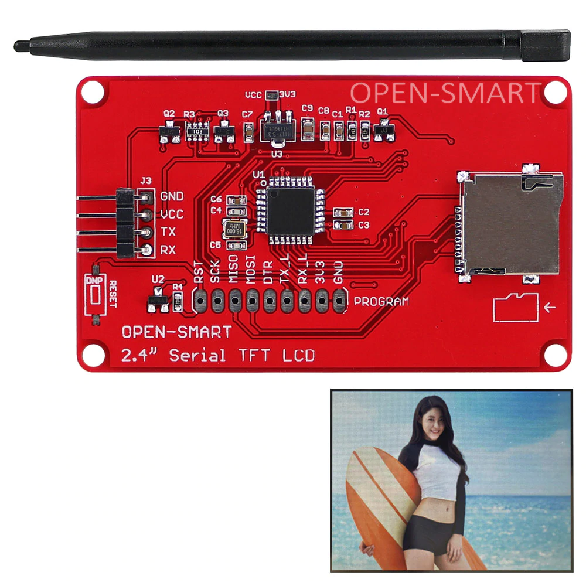

# OpenSmart LCD

Here I'm going to use `320*240 Serial TFT` version.

It look like this:



## Use Python with TTL USB

```python
"""
author: yingshaoxo
gmail: yingshaoxo@gmail.com

ls -l /dev/ttyUSB0
sudo usermod -a -G uucp yingshaoxo
sudo chmod a+rw /dev/ttyUSB0
"""
import serial
import binascii
from time import sleep
import random


#DEBUG = False
DEBUG = True


def int_to_byte(integer, length=2):
    hex_string = '{:02X}'.format(integer)
    ok = 0
    while ok == 0:
        try:
            padding_hex = hex_string.zfill(length)
            a_byte = binascii.unhexlify(padding_hex)
            ok = 1
        except Exception as e:
            # print(e)
            length += 2
    return a_byte


def byte_to_int(a_byte):
    hex_string = binascii.hexlify(a_byte)
    integer = int(hex_string, 16)
    return integer


def byte_to_string(a_byte, length=2):
    return format(byte_to_int(a_byte), "02X").zfill(length)
    # return '{0:02X}'.format(byte_to_int(a_byte))


def hex_to_bytes(a_hex_string):
    return bytes.fromhex(a_hex_string)


def text_to_hex(text):
    length = len(text)*2
    bytes_ = binascii.hexlify(text.encode("ascii", "ignore"))
    result = str(bytes_)
    result = result[2:][:-1]
    return result


class SmartOpen_LCD():
    def __init__(self):
        self.serial = serial.Serial('/dev/ttyUSB0', 115200, timeout=0.1, write_timeout=0.1)  # open serial port
        print()
        print('-'*20)
        print(self.serial.name)         # check which port was really used
        print('-'*20)
        print()

        self.color_table = {
            "black": "0000",
            "blue": "001F",
            "red": "F800",
            "green": "07E0",
            "cyan": "07FF",
            "magenta": "F81F",
            "yellow": "FFE0",
            "white": "FFFF",
        }

        self.wait(1.5)
        self.set_baud()

    def wait(self, time=1):
        sleep(time)

    def reset(self):
        self.write_command("7E0205EF")
        self.wait(6)

    def set_baud(self):
        baud_index = byte_to_string(int_to_byte(4))
        self.write_command(f"7E0340{baud_index}EF")

    def read_feedback_signal(self):
        bytes_string = ""
        start = 0
        attempts = 6
        while attempts:
            attempts -= 1
            #print(attempts)
            if self.serial.readable():
                a_byte = self.serial.read(1)
                if a_byte:
                    byte_string = byte_to_string(a_byte)
                    #print(f"read: {byte_string}")
                    if byte_string == "7E":
                        start = 1
                    if start == 1:
                        bytes_string += byte_string
                        if byte_string == "EF":
                            return byte_to_string

    def wait_for_command_to_be_executed(self):
        if self.read_feedback_signal() == "7E036F6BEF":
            return True
        else:
            return False

    def write_command(self, hex_string):
        if self.serial.writable():
            self.serial.write(hex_to_bytes(hex_string))
            if DEBUG:
                print(f"write: {hex_string}")
        self.wait_for_command_to_be_executed()

    def set_blacklight(self, brightness):
        brightness_hex = byte_to_string(int_to_byte(brightness))
        self.write_command(f"7E0306{brightness_hex}EF")

    def fill_screen(self, color="white"):
        if color in self.color_table.keys():
            color = self.color_table[color]
        self.write_command(f"7E0420{color}EF")

    def draw_pixel(self, x, y, color="black"):
        if color in self.color_table.keys():
            color = self.color_table[color]
        x = byte_to_string(int_to_byte(x), 4)
        y = byte_to_string(int_to_byte(y), 4)
        self.write_command(f"7E0821{x}{y}{color}EF")

    def draw_rectangle(self, x, y, width, height, color="black"):
        if color in self.color_table.keys():
            color = self.color_table[color]
        x = byte_to_string(int_to_byte(x), 4)
        y = byte_to_string(int_to_byte(y), 4)
        width = byte_to_string(int_to_byte(width), 4)
        height = byte_to_string(int_to_byte(height), 4)
        self.write_command(f"7E0C26{x}{y}{width}{height}{color}EF")

    def write_string(self, x, y, text):
        # set cursor
        self.write_command(f"7E060100000000EF")

        # set Text color
        self.write_command(f"7E0402f800EF")

        # set text size
        self.write_command(f"7E030302EF")

        def chunkstring(string, length):
            return [string[0+i:length+i] for i in range(0, len(string), length)]

        for i in range(y*2):
            # new line
            self.write_command(f"7E0210EF")
            self.write_command(f"7E0210EF")

        text_list = chunkstring(text, 5)
        for index, text in enumerate(text_list):
            text = text_to_hex(text.ljust(5))
            self.write_command(f"7E0711{text}EF")


color_table = {
    "black": "0000",
    "blue": "001f",
    "red": "f800",
    "green": "07e0",
    "cyan": "07ff",
    "magenta": "f81f",
    "yellow": "ffe0",
    "white": "ffff",
}

lcd = SmartOpen_LCD()

# lcd.reset()
lcd.set_blacklight(150)
color = random.choice(list(lcd.color_table.keys()))
lcd.fill_screen(color)

"""
# 80x80 points
width = 240
height = 240
box_length = width // 16
for y in range(16):
    for x in range(16):
        color = random.choice(list(lcd.color_table.keys()))
        box_x = x * box_length
        box_y = y * box_length
        lcd.draw_rectangle(box_x, box_y, box_length, box_length, color=color)
"""

"""
### write string
lcd.write_string(0, 0, "Hi, i'm yingshaoxo")
lcd.write_string(0, 1, "The greatest man in this world")
lcd.write_string(0, 2, "Do you love me?")
lcd.write_string(0, 3, "I guess yes")
"""

"""
### draw a squre
height = 240
width = 320
for y in range(height):
    color = random.choice(list(lcd.color_table.keys()))
    print(str(y/height), color)
    for x in range(width):
        if x < width//4:
            if y < height//4:
                lcd.draw_pixel(x, y, color)
"""

#"""
### change screen color
while 1:
    for color in color_table.keys():
        lcd.fill_screen(color)
        lcd.wait(0.5)
#"""

```

## Use MSP430F169

```c
#include <msp430f169.h> 
#include <stdio.h>
#include <stdlib.h>
#include <string.h>
#include <limits.h> // CHAR_BIT, UCHAR_MAX


// ***************
// ****************
// SET OpenSmart LCD!!!!!!!!!!!!!!!!!!!!!!!!!!!!!!!!!!!!!!!
// P3.6: TX
// P3.7: RX
// ***************
// ****************

void millisecond_of_delay(unsigned long int t) {
    t = t * 8;
    while (t--) {
        // delay for 1ms
        __delay_cycles(1000);
    }
}

void OpenSmart_write_command(unsigned char array[], unsigned int length) {
    // this function may send 0x00 on error
    int i;
    for (i=0; i< length; i++) {
        while (!(IFG2 & UTXIFG1)) {
        };                // USART1 TX buffer ready?
        TXBUF1 = array[i];
    }
}

void test_OpenSmart_write_command(unsigned char a_byte) {
    unsigned char list[1];
    list[0] = a_byte;
    OpenSmart_write_command(list, 1);
}

unsigned int reading_finished = 1;
unsigned char bytes_we_got[30];
unsigned int bytes_length = 0;
void OpenSmart_read_command() {
    unsigned int bytes_index = 0;
    long int max_attempts = 100000; // you may want to add more zero here

    while (1) {
        while (!(IFG2 & URXIFG1)) {
            // USART1 RX buffer is not ready? if so we stuck here
            max_attempts--;
            if (max_attempts < 0) {
                return;
            }
        }

        if (reading_finished == 1) {
            if (RXBUF1 == 0x7e) {
                reading_finished = 0;
            }
        }
        if (reading_finished == 0) {
            bytes_we_got[bytes_index] = RXBUF1;
            bytes_index = bytes_index + 1;
        }
        if (RXBUF1 == 0xef) {
            bytes_length = bytes_index;
            reading_finished = 1;
            break;
        }
    }
}

void OpenSmart_wait_for_command_to_be_executed() {
    OpenSmart_read_command();

    // we do nothing here since we don't care the result;
    if (reading_finished == 1) {
        //print(bytes_we_got);
        //print(length_of_bytes_we_got);

        //OpenSmart_write_command(bytes_we_got, bytes_length);
    }
}

void OpenSmart_write_command_safely(unsigned char array[], unsigned int length) {
    OpenSmart_write_command(array, length);
    OpenSmart_wait_for_command_to_be_executed();
}

void OpenSmart_fill_LCD_with_black_color() {
    unsigned char fill_screen_with_black[] = {0x7E, 0x04, 0x20, 0x00, 0x00, 0xEF};
    OpenSmart_write_command_safely(fill_screen_with_black, 6);
}

void OpenSmart_fill_LCD_with_white_color() {
    unsigned char fill_screen_with_white[] = {0x7E, 0x04, 0x20, 0xff, 0xff, 0xEF};
    OpenSmart_write_command_safely(fill_screen_with_white, 6);
}

void OpenSmart_print_string(unsigned int x, unsigned int y, unsigned char *string) {
    // set cursor
    unsigned char set_cursor[] = {0x7e, 0x06, 0x01, 0x00, 0x00, 0x00, 0x00, 0xef};
    OpenSmart_write_command_safely(set_cursor, 8);

    // set Text color
    unsigned char set_text_color[] = {0x7e, 0x04, 0x02, 0xf8, 0x00, 0xef};
    OpenSmart_write_command_safely(set_text_color, 6);

    // set text size
    unsigned char set_text_size[] = {0x7e, 0x03, 0x03, 0x03, 0xef};
    OpenSmart_write_command_safely(set_text_size, 5);

    // to new line
    unsigned char new_line[] = {0x7e, 0x02, 0x10, 0xef};
    int i;
    for (i=0; i < y; i++) {
        OpenSmart_write_command_safely(new_line, 4);
        OpenSmart_write_command_safely(new_line, 4);
        OpenSmart_write_command_safely(new_line, 4);
    }

    // split string to chunks
    int string_length = strlen(string);
    int number_of_chunks = (string_length/5) + 1;
    unsigned char chunks[10][5];
    int chunk_index;
    for (chunk_index=0; chunk_index < number_of_chunks; chunk_index++) {
        for (i=0; i < 5; i++) {
            if (*string > 0) {
                chunks[chunk_index][i] = *string;
                string++;
            } else {
                chunks[chunk_index][i] = 0x20;
            }
        }
    }

    // send text chunks to LCD
    unsigned char text[9];
    for (chunk_index=0; chunk_index < number_of_chunks; chunk_index++) {
        text[0] = 0x7e;
        text[1] = 0x07;
        text[2] = 0x11;
        for (i=0; i < 5; i++) {
            text[i+3] = chunks[chunk_index][i];
        }
        text[8] = 0xef;
        OpenSmart_write_command_safely(text, 9);
    }
}

void OpenSmart_print_number(int x, int y, long int number) {
    char text[20];
    sprintf(text, "%d", number);
    print_string(x, y, text);
}

void OpenSmart_print_float(int x, int y, float number) {
    char text[20];
    sprintf(text, "%f", number);
    print_string(x, y, text);
}

unsigned char * int_to_bytes_array(short int num) {
    unsigned char bytes[sizeof(int)];
    int i;
    for (i=0; i<sizeof(int); i++)
    {
        bytes[i] = num & UCHAR_MAX;
        num >>= CHAR_BIT;
    }
    return bytes;
}

void OpenSmart_draw_rectangle(short int x, short int y, short int width, short int height) {
    unsigned char text[14];
    
    // start
    text[0] = 0x7e;
    text[1] = 0x0c;
    text[2] = 0x26;

    // x
    text[3] = int_to_bytes_array(x)[1];
    text[4] = int_to_bytes_array(x)[0];

    // y
    text[5] = int_to_bytes_array(y)[1];
    text[6] = int_to_bytes_array(y)[0];

    // width
    text[7] = int_to_bytes_array(width)[1];
    text[8] = int_to_bytes_array(width)[0];

    // height
    text[9] = int_to_bytes_array(height)[1];
    text[10] = int_to_bytes_array(height)[0];

    // color
    text[11] = 0x00;
    text[12] = 0x00;

    // end
    text[13] = 0xef;

    OpenSmart_write_command_safely(text, 14);
}

void initialize_OpenSmart_LCD() {
    volatile unsigned int i;
    WDTCTL = WDTPW + WDTHOLD;                 // Stop WDT
    P3SEL |= 0xC0;                            // P3.6 and P3.7 = USART1 option select; 3.6 TX, 3.7 RX

    BCSCTL1 &= ~XT2OFF;                       // XT2on

    do
    {
        IFG1 &= ~OFIFG;                           // Clear OSCFault flag
        for (i = 0xFF; i > 0; i--);               // Time for flag to set
    }
    while ((IFG1 & OFIFG));                   // OSCFault flag still set?

    BCSCTL2 |= SELM_2 + SELS;                 // MCLK= SMCLK= XT2 (safe)
    ME2 |= UTXE1 + URXE1;                     // Enable USART1 TXD/RXD
    UCTL1 |= CHAR;                            // 8-bit character
    UTCTL1 |= SSEL1;                          // UCLK = SMCLK
    UBR01 = 0x45;                             // 8Mhz/115200 - 69.44
    UBR11 = 0x00;                             //
    UMCTL1 = 0x2C;                            // modulation
    UCTL1 &= ~SWRST;                          // Initialize USART state machine

    //IE2 |= URXIE1;                            // Enable USART1 RX interrupt
    //_BIS_SR(GIE); // just enable general interrupt

    millisecond_of_delay(1000*8); // wait for LCD to wake up

    // you must add [] if you want to define an array in C
    unsigned char set_baud[] = {0x7E, 0x03, 0x40, 0x04, 0xEF};
    unsigned char set_blacklight[] = {0x7E, 0x03, 0x06, 0x96, 0xEF};
    OpenSmart_write_command_safely(set_baud, 5);
    OpenSmart_write_command_safely(set_blacklight, 5);
}

void screen_clean() {
    OpenSmart_fill_LCD_with_white_color();
}

void print_string(unsigned int x, unsigned int y, unsigned char *string) {
    OpenSmart_print_string(x, y, string);
}

void print_number(int x, int y, long int number) {
    OpenSmart_print_number(x, y, number);
}

void print_float(int x, int y, float number) {
    OpenSmart_print_float(x, y, number);
}

void test_print_string() {
    OpenSmart_fill_LCD_with_black_color();

    print_string(0, 0, "hi, yingshaoxo");
    print_string(0, 1, "hi, yingshaoxo");
    print_float(0, 2, -2.552255);
    print_number(0, 3, 666);
}

int main(void) {
    initialize_OpenSmart_LCD();
    OpenSmart_fill_LCD_with_white_color();

    OpenSmart_print_string(0, 0, " hello, everyone!");

    int width = 1;
    while(1) {
        OpenSmart_draw_rectangle(80, 70, width, width);
        width += 1;
        if (width > 150) {
            width = 0;
            OpenSmart_fill_LCD_with_white_color();
            OpenSmart_print_string(0, 0, " hello, everyone!");
        }
    }
}
```

## Use Python to Debug

```python
"""
author: yingshaoxo
gmail: yingshaoxo@gmail.com

ls -l /dev/ttyUSB0
sudo usermod -a -G uucp yingshaoxo
sudo chmod a+rw /dev/ttyUSB0
"""
import serial
import binascii
from time import sleep


def int_to_byte(integer):
    hex_string = '{:02x}'.format(integer)
    a_byte = binascii.unhexlify(hex_string)
    return a_byte


def byte_to_int(a_byte):
    hex_string = binascii.hexlify(a_byte)
    integer = int(hex_string, 16)
    return integer


def byte_to_string(a_byte, length=2):
    return format(byte_to_int(a_byte), "02X").zfill(length)


ser = serial.Serial('/dev/ttyUSB0', 115200)  # open serial port
# ser = serial.Serial('/dev/ttyUSB0', 9600)  # open serial port
print(ser.name)         # check which port was really used

start = 0
i = 0
string = ""
print()
print("7e036f6bef")
print('-'*10)
while 1:
    if ser.writable():
        #ser.write(int_to_byte(i))  # write one byte
        ser.write(bytes.fromhex("7e036f6bef"))
    if ser.readable():
        a_byte = ser.read(1)  # read one byte
        #print(a_byte.hex())
        if (a_byte.hex() == "7e"):
            start = 1
        if (start == 1):
            string += a_byte.hex()
            if a_byte.hex() == "ef":
                print(string)
                if (string != "7e042007e0ef"):
                    pass
                    #break
                start = 0
                string = ""

    i += 1
    if i > 255:
        i = 0
```

## References:




