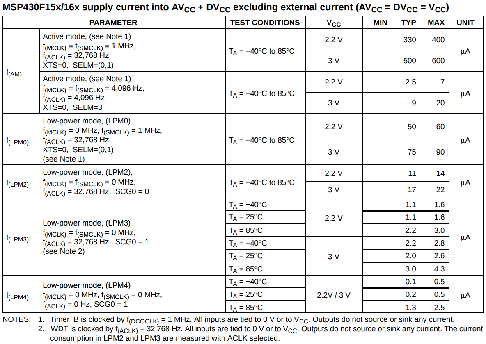

# Timer

```c
#include <msp430.h>

void main(void)
{
    WDTCTL = WDTPW + WDTHOLD;                 // Stop WDT

    P6DIR |= BIT0;                            // P6.0 output

    TBCCTL0 = CCIE;                           // CCR0 interrupt enabled
    TBCCR0 = 50000;                           // Counting number
    TBCTL = TBSSEL_2 + MC_2;                  // SMCLK + Continuous up count mode

    _BIS_SR(LPM0_bits + GIE);                 // Enter LPM0 w/ interrupt

    while (1)
    {
        ;
    }
}

// Timer B0 interrupt service routine
#pragma vector=TIMERB0_VECTOR
__interrupt void Timer_B(void)
{
    P6OUT ^= BIT0;                            // Toggle P6.0
    TBCCR0 += 50000;                          // Add Offset to CCR0
}
```

## Control Timer

TBCCTL0 = Timer B Capture/Compare Control 0

CCIE = Capture/compare interrupt enable

TBCCR0 = Timer B Capture/Compare Register 0

> Since I can't find any explanation about TBCCR, I treat it as a variable where saves the `delay time` for timer B

TBCTL = Timer B Control

TBSSEL\_2 = Timer B Source-clock Select 2 \(which is SMCLK\)

* ~~TBCLK: Time based clock. \(I don't know this\)~~
* ACLK: Auxiliary clock, is usually a 32kHz crystal clock. It is used for peripheral modules that require a low-frequency clock \(e.g. real-time-clock, ...\)
* SMCLK: Sub-main clock, is usually a high frequency clock and it is used for peripheral modules \(e.g. Timers, serial communication modules, ...\)
* ~~INCLK: \(I don't know this\)~~
* ~~MCLK: Master clock, is used as clock source for the CPU.~~

MC\_2 = mode control: 2 - Continuous up

> "Continuous" mode is typically the most used one. It counts until the overflow of the timer register, then restarts from zero.
>
> You can also use the "up" mode. In that case the timer counter should automatically reset to zero after reaching CCR. \(MC\_1 will do that\)

## Define an Interrupt Service Routine

\_BIS\_SR\(mask\) = \_bis\_SR\_register\(mask\) = **\_\_bis\_SR\_register** sets the bits specified in **mask** in the MSP430 status register \(i.e. it bitwise-ors **mask** into the status register\).

LPM0 = Low Power Mode 0

> You could view those details at `MSP430F169 Datasheet.pdf`

GIE = General Interrupt Enable

\#pragma vector = TIMERB\_VECTOR

> If you write an ISR\(Interrupt Service Routine\), it is just a function. A function with specific entry/exit code. It is a function that is never called by anyone in the source code. So it is a candidate for being discarded at link \(or compile\) time.

> The "\#pragma vector" generates a reference to the following function and locates it at the TIMERB\_VECTOR position in the interrupt vector table. So the ISR gets referenced \(and the linker won’t discard it\) and the CPU knows where to jump in case of an TIMERB interrupt.

## Calculate the counting number for a timer



From the above sheet we know `sub-main clock (SMCLK)` is  $$1 MHz$$ at `low-power mode 0` .

So there must have some ways to calculate that counting number.

## References:






