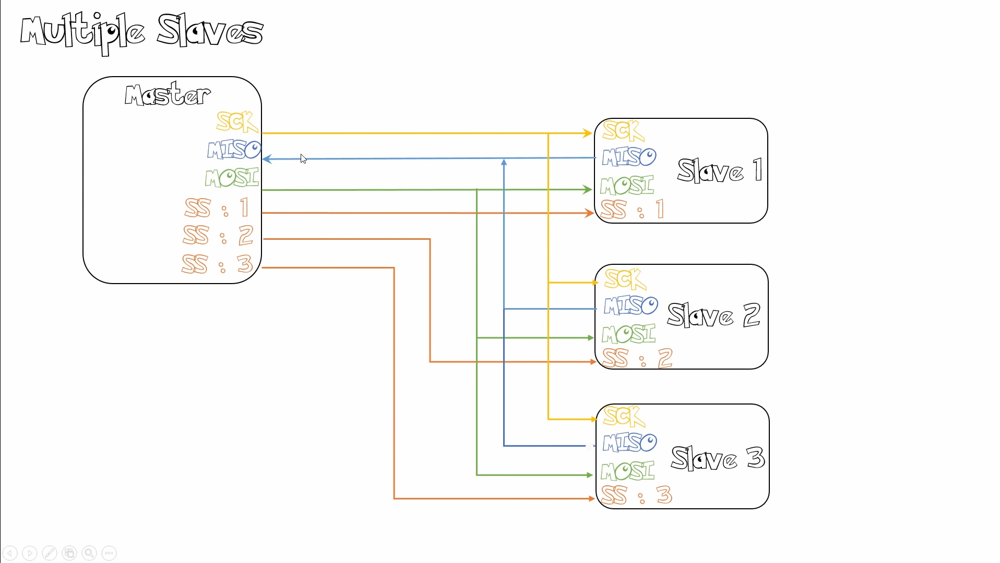

# More on SPI

## Words

* LSBFIRST \(least-significant bit first\), big-endian, &gt;
* MSBFIRST \(most-significant bit first\), little-endian, &lt;

## Multiple-Devices

As you could see, we use `ss` to select which device we want to use though we only got one SPI hardware master controller.

